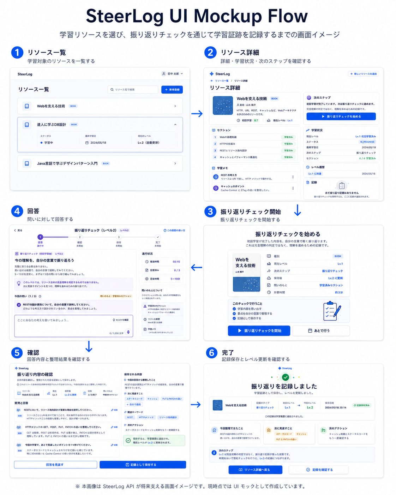

# SteerLog API

SteerLog API は、エンジニアの学習 Resource、進捗、Section、メモ、Level 履歴を管理する API です。  
単なる学習時間管理ではなく、**学習証跡と理解段階を記録する** ことが目的です。

現在は MVP として **Phase 1〜8 まで実装済み** です（Lv.1〜Lv.3、LearningSession、Resource 統合詳細まで）。

---

## UI Mockup / 画面イメージ

SteerLog は現在、バックエンド API を中心に実装しているアプリケーションです。  
以下の画面は、実装済み API が将来的にどのようなユーザー体験を支えるかを示すための UI モックです。

> 現時点ではフロントエンド実装ではなく、SteerLog API が支える画面イメージとして作成しています。

### UI Flow



学習リソースを選択し、リソース詳細から振り返りチェックを開始し、回答・確認・記録保存を通じて学習証跡として残す流れを表しています。

### Screens

| No | 画面 | 役割 | 画像 |
| -: | ---------- | ------------------------------ | ------------------------------------------------ |
| 1 | リソース一覧 | 学習対象のリソースを一覧し、詳細画面へ進む入口 | [画像を見る](docs/mockups/01-resource-list.png) |
| 2 | リソース詳細 | 現在レベル、学習済みセクション、メモ、次のステップを確認 | [画像を見る](docs/mockups/02-resource-detail.png) |
| 3 | 振り返りチェック開始 | Lv.1 のリソースに対して、振り返りチェックを開始 | [画像を見る](docs/mockups/03-reflection-start.png) |
| 4 | 回答画面 | 問いに対して自分の言葉で回答。音声入力も補助的に利用可能 | [画像を見る](docs/mockups/04-reflection-answer.png) |
| 5 | 確認画面 | 質問・回答と、保存される整理内容を確認 | [画像を見る](docs/mockups/05-reflection-review.png) |
| 6 | 完了画面 | 記録保存後、Lv.1 から Lv.2 へ更新されたことを確認 | [画像を見る](docs/mockups/06-reflection-complete.png) |

この UI モックは、完成済みのフロントエンドではなく、バックエンド API の利用イメージを伝えるための資料です。  
実装済み API では、Resource / Progress / ResourceSection / StudyMemo / LearningSession / LearningSessionRecord / LevelHistory を扱い、学習リソースと振り返り記録を紐づけて管理します。

---

## 技術スタック

- Java 21
- Spring Boot 3.4.5
- Maven
- PostgreSQL
- Flyway（V1〜V9）
- Spring Data JPA
- JUnit 5
- Mockito
- MockMvc
- Docker Compose
- Lombok なし

認証は未実装。Controller では `TEMP_USER_ID = 1L` 固定。

---

## 実装済み機能

### Resource

- `POST /resources`
- `GET /resources`
- `GET /resources/{resourceId}`（簡易詳細: Resource + Progress）
- `GET /resources/{resourceId}/details`（統合詳細）
- `PATCH /resources/{resourceId}`
- `DELETE /resources/{resourceId}`

### Progress / LevelHistory

- `GET /resources/{resourceId}/progress`
- `POST /resources/{resourceId}/progress/complete-initial-study`
- `GET /resources/{resourceId}/level-histories`
- Lv.1 明示到達 / 全 Section 学習済みによる Lv.1 自動到達
- Lv.2 / Lv.3 到達（LearningSessionRecord 保存時）
- LevelHistory 重複防止

### ResourceSection / SectionStudyStatus

- `POST /resources/{resourceId}/sections`
- `GET /resources/{resourceId}/sections`
- `PATCH /resources/{resourceId}/sections/{sectionId}/study-status`
- Section 作成時に SectionStudyStatus 自動作成

### StudyMemo

- `POST /resources/{resourceId}/memos`
- `GET /resources/{resourceId}/memos`
- `PATCH /resources/{resourceId}/memos/{memoId}`
- `DELETE /resources/{resourceId}/memos/{memoId}`

### LearningSession / LearningSessionRecord

- `POST /resources/{resourceId}/learning-sessions`
- `POST /resources/{resourceId}/learning-sessions/{learningSessionId}/responses`
- `POST /resources/{resourceId}/learning-sessions/{learningSessionId}/complete`
- `POST /resources/{resourceId}/learning-sessions/{learningSessionId}/record`
- `POST /resources/{resourceId}/learning-sessions/{learningSessionId}/discard`
- IMMEDIATE_REFLECTION → Lv.2、DELAYED_RECALL → Lv.3
- AI 連携は未実装（`aiPrompt` / `resultDraft` は固定文言、`resultDraft` は DB 非保存）

### Resource Detail（統合詳細）

`GET /resources/{resourceId}/details` で以下を一括取得:

- Resource / Progress
- Sections + SectionStudyStatus
- StudyMemos / LevelHistories / LearningSessionRecords

---

## 起動方法

```bash
docker compose up -d
mvn spring-boot:run
```

---

## テスト実行方法

```bash
mvn test
```

---

## 手動動作確認

[docs/09-manual-api-check.md](docs/09-manual-api-check.md) を参照してください。

| 対象 | 実施日 | 結果 |
|------|--------|------|
| Step 1〜14（Resource〜StudyMemo） | 2026-06-07 | 確認済み |
| Step 15〜25、27〜28（Resource Detail / LearningSession） | 2026-06-13 | 確認済み |

---

## 主要ドキュメント

- [docs/README.md](docs/README.md) - docs 全体の案内
- [docs/00-product-principles.md](docs/00-product-principles.md) - プロダクト思想
- [docs/01-mvp-scope.md](docs/01-mvp-scope.md) - MVP 範囲
- [docs/02-db-design.md](docs/02-db-design.md) - DB 設計（ドメイン関係図含む）
- [docs/03-api-design.md](docs/03-api-design.md) - API 設計
- [docs/04-level-rules.md](docs/04-level-rules.md) - Level 到達ルール
- [docs/05-learning-session-flow.md](docs/05-learning-session-flow.md) - LearningSession フロー
- [docs/06-implementation-rules.md](docs/06-implementation-rules.md) - 実装ルール
- [docs/07-implementation-order.md](docs/07-implementation-order.md) - 実装順序
- [docs/08-ai-development-workflow.md](docs/08-ai-development-workflow.md) - AI 開発フロー
- [docs/09-manual-api-check.md](docs/09-manual-api-check.md) - 手動 API 確認
- [docs/10-resource-detail-design.md](docs/10-resource-detail-design.md) - Resource Detail API 設計

---

## 未実装 / Next（MVP 内）

- 認証
- `PATCH /resources/{resourceId}/progress`
- `GET /resources/{resourceId}/memos/{memoId}`
- `GET /resources/{resourceId}/sections/{sectionId}/study-status`
- `PATCH /resources/{resourceId}/sections/{sectionId}`
- `DELETE /resources/{resourceId}/sections/{sectionId}`
- StudyMemo `tags` / `important`

## MVP 外（まだ作らない）

- AI 連携（動的 `aiPrompt` / `resultDraft`）
- Lv.4 / Lv.5
- Galaxy / MCP / 学習時間管理
