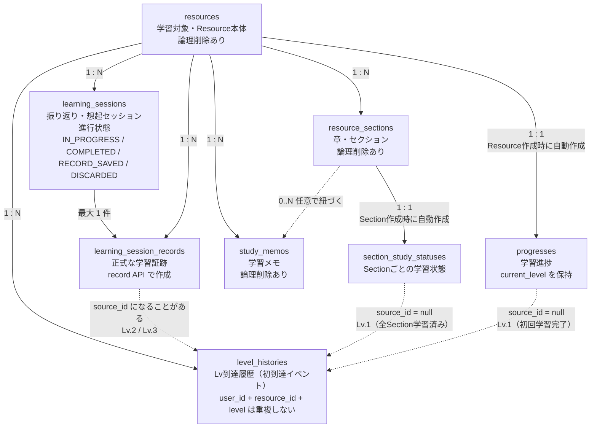

# 02-db-design.md

# SteerLog MVP DB Design

## 目的

このドキュメントは、SteerLog MVPで使用するDB設計を定義する。  
Flyway migration、Entity、Repository、Service実装時は、この内容を基準にする。

MVPのDBは、以下を目的に設計する。

```text
Resource単位の学習対象を管理する
Section単位の学習状態を管理する
Resource単位のProgressを管理する
短いStudyMemoを保存する
LearningSessionの進行状態を管理する
LearningSessionRecordとして正式証跡を保存する
LevelHistoryとしてLevel初到達履歴を保存する
```

---

# 1. DB共通方針

## 1.1 DBMS

MVPでは PostgreSQL を使用する。

理由：

```text
テーブル間の関係が多い
外部キー・一意制約・CHECK制約を使いたい
トランザクションで状態更新を安全に扱いたい
将来のタグ検索・証跡集計・Galaxy APIに拡張しやすい
```

---

## 1.2 ID方針

内部学習管理テーブルの主キーは `BIGINT` を使用する。

対象：

```text
resources
resource_sections
progresses
section_study_statuses
study_memos
learning_sessions
learning_session_records
level_histories
```

外部公開プロフィール、共有リンク、公開APIなどはMVP外。  
将来的には `UUID` / `public_id` / `handle` / `slug` などを検討する。

重要：

```text
UUIDは認可の代替ではない。
内部APIでは必ずuser_idで所有者チェックする。
```

---

## 1.3 datetime方針

日時型は PostgreSQL の `TIMESTAMPTZ` を使う。

全主要テーブルに以下を持たせる。

```text
created_at
updated_at
```

例外: `level_histories` は `created_at` のみ（`updated_at` なし）。

論理削除対象テーブルには以下を持たせる。

```text
deleted_at
```

ビジネス日時は別カラムとして持つ。

例：

```text
started_at
completed_at
archived_at
initial_studied_at
last_studied_at
studied_at
```

MVP では `learning_sessions` に `discarded_at` / `record_saved_at` 専用カラムは持たない。  
破棄は `status = DISCARDED`、証跡保存完了は `status = RECORD_SAVED` で表す。

---

## 1.4 削除方針

論理削除するテーブル：

```text
resources
resource_sections
study_memos
```

論理削除しないテーブル：

```text
progresses
section_study_statuses
learning_sessions
learning_session_records
level_histories
```

理由：

```text
progresses / section_study_statuses は親Resource/Sectionの表示状態に従う
learning_sessions は deleted_at ではなく status=DISCARDED で破棄を表す
learning_session_records は正式証跡なのでMVPでは削除しない
level_histories は初到達履歴なのでMVPでは削除しない
```

---

# 2. テーブル一覧

MVPでは以下の8テーブルを作る。

```text
resources
resource_sections
progresses
section_study_statuses
study_memos
learning_sessions
learning_session_records
level_histories
```

MVPでは作らないテーブル：

```text
check_records
check_questions
review_records
answers
artifacts
defense_records
tags
resource_tags
section_tags
learning_cycles
galaxy_nodes
galaxy_edges
```

---

# 2.5 ドメイン関係図

MVP の主要 8 テーブルがどのように関係するかを示す。  
API 実装や Service 設計時に、テーブルごとの責務と参照関係を思い出すための図である。

DB 上は外部キーでつながるが、Java Entity では `@ManyToOne` は使わず `resourceId` などの `Long` ID で扱う。

## 2.5.1 関係図



## 2.5.2 補足

* `Progress` は Resource 作成時に自動作成するため、直接作成 API はない
* `SectionStudyStatus` は Section 作成時に自動作成する
* `LearningSession` は進行状態であり、正式証跡ではない
* `LearningSessionRecord` が正式な学習証跡である
* `LevelHistory` は初到達イベントであり、証跡本文ではない
* Lv.1 の `LevelHistory` は `source_id = null`（`INITIAL_STUDY_COMPLETION` または `SECTION_STUDY_STATUS`）
* Lv.2 / Lv.3 の `LevelHistory` は `source_type = LEARNING_SESSION_RECORD`、`source_id = learning_session_record_id`
* `StudyMemo` は学習メモだが、作成・更新・削除では Level を上げない
* `resources` / `resource_sections` / `study_memos` は論理削除対象
* Entity では現時点で `@ManyToOne` は使わず、`resourceId` などの Long ID で扱う方針

---

# 3. resources

## 3.1 役割

`resources` は、ユーザーが登録する学習対象を表す。

例：

```text
本
記事
動画
講座
問題
実装課題
ドキュメント
その他
```

## 3.2 カラム

| 物理名 | 論理名 | 型 | 必須 | 説明 |
|---|---|---:|---:|---|
| resource_id | リソースID | BIGSERIAL | ○ | 主キー |
| user_id | ユーザーID | BIGINT | ○ | 所有ユーザー |
| resource_type | リソース種別 | VARCHAR(50) | ○ | BOOK等 |
| title | タイトル | VARCHAR(255) | ○ | Resource名 |
| author | 著者・作成者 | VARCHAR(255) |  | 任意 |
| source_url | 参照URL | TEXT |  | 任意 |
| description | 説明 | TEXT |  | 任意 |
| deleted_at | 削除日時 | TIMESTAMPTZ |  | 論理削除 |
| created_at | 作成日時 | TIMESTAMPTZ | ○ | 作成日時 |
| updated_at | 更新日時 | TIMESTAMPTZ | ○ | 更新日時 |

## 3.3 resource_type

```text
BOOK
ARTICLE
VIDEO
COURSE
PROBLEM
IMPLEMENTATION
DOCUMENTATION
OTHER
```

## 3.4 制約・Index

```sql
PRIMARY KEY (resource_id)
```

```sql
CHECK (resource_type IN (
  'BOOK',
  'ARTICLE',
  'VIDEO',
  'COURSE',
  'PROBLEM',
  'IMPLEMENTATION',
  'DOCUMENTATION',
  'OTHER'
))
```

```sql
CREATE INDEX idx_resources_user_id
ON resources (user_id);
```

```sql
CREATE INDEX idx_resources_user_deleted
ON resources (user_id, deleted_at);
```

## 3.5 判断

同じタイトル・著者のResource重複はDB制約で禁止しない。  
ユーザーの意図や学習文脈が異なる可能性があるため、重複警告は将来UIで対応する。

---

# 4. resource_sections

## 4.1 役割

`resource_sections` は、Resource内の章・節・チャプター・レッスンを表す。

## 4.2 カラム

| 物理名 | 論理名 | 型 | 必須 | 説明 |
|---|---|---:|---:|---|
| resource_section_id | リソースセクションID | BIGSERIAL | ○ | 主キー |
| user_id | ユーザーID | BIGINT | ○ | 所有ユーザー |
| resource_id | リソースID | BIGINT | ○ | 親Resource |
| title | セクション名 | VARCHAR(255) | ○ | 章名・節名 |
| section_order | 表示順 | INTEGER | ○ | 並び順 |
| deleted_at | 削除日時 | TIMESTAMPTZ |  | 論理削除 |
| created_at | 作成日時 | TIMESTAMPTZ | ○ | 作成日時 |
| updated_at | 更新日時 | TIMESTAMPTZ | ○ | 更新日時 |

## 4.3 制約・Index

```sql
PRIMARY KEY (resource_section_id)
```

```sql
FOREIGN KEY (resource_id)
REFERENCES resources(resource_id)
```

```sql
CHECK (section_order >= 1)
```

```sql
CREATE UNIQUE INDEX uq_resource_sections_user_resource_order
ON resource_sections (user_id, resource_id, section_order);
```

```sql
CREATE INDEX idx_resource_sections_user_resource_deleted
ON resource_sections (user_id, resource_id, deleted_at);
```

```sql
CREATE INDEX idx_resource_sections_resource_order
ON resource_sections (resource_id, section_order);
```

## 4.4 判断

Section作成時に、対応する `section_study_statuses` も作成する。

---

# 5. progresses

## 5.1 役割

`progresses` は、Resource単位のユーザー学習状態を表す。

## 5.2 カラム

| 物理名 | 論理名 | 型 | 必須 | 説明 |
|---|---|---:|---:|---|
| progress_id | 進捗ID | BIGSERIAL | ○ | 主キー |
| user_id | ユーザーID | BIGINT | ○ | 所有ユーザー |
| resource_id | リソースID | BIGINT | ○ | 対象Resource |
| status | 進捗ステータス | VARCHAR(50) | ○ | NOT_STARTED等 |
| current_level | 現在到達Level | INTEGER | ○ | 0〜5 |
| current_section_id | 現在学習中セクションID | BIGINT |  | 現在の主学習位置 |
| started_at | 学習開始日時 | TIMESTAMPTZ |  | 初回開始 |
| completed_at | 学習完了日時 | TIMESTAMPTZ |  | 完了日時 |
| archived_at | アーカイブ日時 | TIMESTAMPTZ |  | 学習対象から外した日時 |
| archive_reason | アーカイブ理由 | VARCHAR(500) |  | 学習対象から外した理由 |
| initial_studied_at | 初回学習完了日時 | TIMESTAMPTZ |  | Lv.1 Resource一括完了 |
| last_studied_at | 最終学習日時 | TIMESTAMPTZ |  | 最終学習更新 |
| created_at | 作成日時 | TIMESTAMPTZ | ○ | 作成日時 |
| updated_at | 更新日時 | TIMESTAMPTZ | ○ | 更新日時 |

## 5.3 status

```text
NOT_STARTED
IN_PROGRESS
PAUSED
ARCHIVED
COMPLETED
```

## 5.4 制約・Index

```sql
PRIMARY KEY (progress_id)
```

```sql
FOREIGN KEY (resource_id)
REFERENCES resources(resource_id)
```

`current_section_id` は DB 外部キー制約なし。整合性はアプリケーション側で確認する。

```sql
CREATE UNIQUE INDEX uq_progresses_user_resource
ON progresses (user_id, resource_id);
```

```sql
CHECK (current_level BETWEEN 0 AND 5)
```

```sql
CHECK (status IN (
  'NOT_STARTED',
  'IN_PROGRESS',
  'PAUSED',
  'ARCHIVED',
  'COMPLETED'
))
```

## 5.5 判断

`current_level` は外部から直接更新させない。  
Lv.1〜Lv.3の到達処理によって更新する。

`ARCHIVED` は削除ではなく、現在の学習対象から外した状態。  
`archived_at` と `archive_reason` は履歴として残す。

---

# 6. section_study_statuses

## 6.1 役割

`section_study_statuses` は、Section単位の学習状態を表す。

## 6.2 カラム

| 物理名 | 論理名 | 型 | 必須 | 説明 |
|---|---|---:|---:|---|
| section_study_status_id | セクション学習状態ID | BIGSERIAL | ○ | 主キー |
| user_id | ユーザーID | BIGINT | ○ | 所有ユーザー |
| resource_id | リソースID | BIGINT | ○ | 対象Resource |
| resource_section_id | リソースセクションID | BIGINT | ○ | 対象Section |
| studied_at | 学習済み日時 | TIMESTAMPTZ |  | 学習済みにした日時 |
| created_at | 作成日時 | TIMESTAMPTZ | ○ | 作成日時 |
| updated_at | 更新日時 | TIMESTAMPTZ | ○ | 更新日時 |

## 6.3 制約・Index

```sql
PRIMARY KEY (section_study_status_id)
```

```sql
FOREIGN KEY (resource_id)
REFERENCES resources(resource_id)
```

```sql
FOREIGN KEY (resource_section_id)
REFERENCES resource_sections(resource_section_id)
```

```sql
CREATE UNIQUE INDEX uq_section_study_statuses_user_section
ON section_study_statuses (user_id, resource_section_id);
```

```sql
CREATE INDEX idx_section_study_statuses_user_resource
ON section_study_statuses (user_id, resource_id);
```

```sql
CREATE INDEX idx_section_study_statuses_user_section
ON section_study_statuses (user_id, resource_section_id);
```

## 6.4 判断

`resource_id` は `resource_section_id` から辿れるが、Resource単位の集計や取得を容易にするため保持する。

ただし、`resource_id` と `resource_section_id` の整合性はアプリケーション側で確認する。

---

# 7. study_memos

## 7.1 役割

`study_memos` は、ユーザーが学習中に残す短い任意メモ。

## 7.2 カラム

| 物理名 | 論理名 | 型 | 必須 | 説明 |
|---|---|---:|---:|---|
| study_memo_id | 学習メモID | BIGSERIAL | ○ | 主キー |
| user_id | ユーザーID | BIGINT | ○ | 所有ユーザー |
| resource_id | リソースID | BIGINT | ○ | 対象Resource |
| resource_section_id | リソースセクションID | BIGINT |  | 対象Section。Resource全体メモならNULL |
| memo_type | メモ種別 | VARCHAR(50) | ○ | GENERAL等 |
| content | メモ内容 | VARCHAR(500) | ○ | 短いメモ |
| deleted_at | 削除日時 | TIMESTAMPTZ |  | 論理削除 |
| created_at | 作成日時 | TIMESTAMPTZ | ○ | 作成日時 |
| updated_at | 更新日時 | TIMESTAMPTZ | ○ | 更新日時 |

## 7.3 memo_type

```text
GENERAL
LEARNED
QUESTION
WEAKNESS
TODO
IDEA
SUMMARY
```

## 7.4 制約・Index

```sql
PRIMARY KEY (study_memo_id)
```

```sql
FOREIGN KEY (resource_id)
REFERENCES resources(resource_id)
```

```sql
FOREIGN KEY (resource_section_id)
REFERENCES resource_sections(resource_section_id)
```

```sql
CHECK (char_length(content) BETWEEN 1 AND 500)
```

```sql
CHECK (memo_type IN (
  'GENERAL',
  'LEARNED',
  'QUESTION',
  'WEAKNESS',
  'TODO',
  'IDEA',
  'SUMMARY'
))
```

```sql
CREATE INDEX idx_study_memos_user_resource_deleted
ON study_memos (user_id, resource_id, deleted_at);
```

```sql
CREATE INDEX idx_study_memos_user_section_deleted
ON study_memos (user_id, resource_section_id, deleted_at);
```

```sql
CREATE INDEX idx_study_memos_user_resource_created
ON study_memos (user_id, resource_id, created_at);
```

## 7.5 判断

StudyMemoはLevel条件ではない。  
StudyMemo作成時に `current_level` は上げない。

`tags` カラムとタグ正規化テーブルはMVP外。

---

# 8. learning_sessions

## 8.1 役割

`learning_sessions` は、AI Reflection / Recall セッションの進行状態を管理する。

正式証跡ではない。  
正式証跡は `learning_session_records`。

## 8.2 カラム

| 物理名 | 論理名 | 型 | 必須 | 説明 |
|---|---|---:|---:|---|
| learning_session_id | 学習セッションID | BIGSERIAL | ○ | 主キー |
| user_id | ユーザーID | BIGINT | ○ | 所有ユーザー |
| resource_id | リソースID | BIGINT | ○ | 対象Resource |
| session_type | セッション種別 | VARCHAR(50) | ○ | IMMEDIATE_REFLECTION等 |
| status | セッション状態 | VARCHAR(50) | ○ | IN_PROGRESS等 |
| current_step | 現在ステップ | INTEGER | ○ | 現在の質問ステップ |
| total_steps | 合計ステップ | INTEGER | ○ | 全体ステップ数 |
| started_at | 開始日時 | TIMESTAMPTZ | ○ | start実行日時 |
| completed_at | 完了日時 | TIMESTAMPTZ |  | complete実行日時 |
| created_at | 作成日時 | TIMESTAMPTZ | ○ | 作成日時 |
| updated_at | 更新日時 | TIMESTAMPTZ | ○ | 更新日時 |

## 8.3 session_type

```text
IMMEDIATE_REFLECTION
DELAYED_RECALL
```

## 8.4 status

```text
IN_PROGRESS
COMPLETED
RECORD_SAVED
DISCARDED
```

## 8.5 制約・Index

```sql
PRIMARY KEY (learning_session_id)
```

```sql
FOREIGN KEY (resource_id)
REFERENCES resources(resource_id)
```

```sql
CHECK (session_type IN (
  'IMMEDIATE_REFLECTION',
  'DELAYED_RECALL'
))
```

```sql
CHECK (status IN (
  'IN_PROGRESS',
  'COMPLETED',
  'RECORD_SAVED',
  'DISCARDED'
))
```

```sql
CHECK (current_step >= 1)
```

```sql
CHECK (total_steps >= 1)
```

```sql
CHECK (current_step <= total_steps)
```

```sql
CREATE INDEX idx_learning_sessions_user_resource_session_status
ON learning_sessions (user_id, resource_id, session_type, status);
```

```sql
CREATE INDEX idx_learning_sessions_resource_id
ON learning_sessions (resource_id);
```

```sql
CREATE UNIQUE INDEX uq_learning_sessions_active
ON learning_sessions (user_id, resource_id, session_type)
WHERE status IN ('IN_PROGRESS', 'COMPLETED');
```

## 8.6 判断

raw回答ログや会話ログ全文は正式保存しない。  
`resultDraft` は complete API のレスポンスのみで返し、DB には保存しない。  
破棄・証跡保存完了は `status`（`DISCARDED` / `RECORD_SAVED`）で表し、専用の日時カラムは持たない。

---

# 9. learning_session_records

## 9.1 役割

`learning_session_records` は、LearningSession完了後にユーザーが保存した正式な学習証跡。

## 9.2 カラム

| 物理名 | 論理名 | 型 | 必須 | 説明 |
|---|---|---:|---:|---|
| learning_session_record_id | 学習セッション記録ID | BIGSERIAL | ○ | 主キー |
| user_id | ユーザーID | BIGINT | ○ | 所有ユーザー |
| resource_id | リソースID | BIGINT | ○ | 対象Resource |
| learning_session_id | 学習セッションID | BIGINT | ○ | 元Session |
| session_type | セッション種別 | VARCHAR(50) | ○ | IMMEDIATE_REFLECTION等 |
| summary | 要約 | TEXT | ○ | AI整理結果 |
| concept_tags | 概念タグ | TEXT |  | カンマ区切り等の文字列 |
| weak_point_summary | 弱点要約 | TEXT |  | NEEDS_REVIEW時に利用 |
| next_action | 次アクション | TEXT |  | 次にやること |
| ai_assessment | AI評価 | VARCHAR(50) | ○ | PASSED等 |
| created_at | 作成日時 | TIMESTAMPTZ | ○ | 作成日時 |
| updated_at | 更新日時 | TIMESTAMPTZ | ○ | 更新日時 |

## 9.3 ai_assessment

```text
PASSED
NEEDS_REVIEW
OFF_TOPIC
```

## 9.4 制約・Index

```sql
PRIMARY KEY (learning_session_record_id)
```

```sql
FOREIGN KEY (resource_id)
REFERENCES resources(resource_id)
```

```sql
FOREIGN KEY (learning_session_id)
REFERENCES learning_sessions(learning_session_id)
```

```sql
CHECK (session_type IN (
  'IMMEDIATE_REFLECTION',
  'DELAYED_RECALL'
))
```

```sql
CHECK (ai_assessment IN (
  'PASSED',
  'NEEDS_REVIEW',
  'OFF_TOPIC'
))
```

```sql
CONSTRAINT uq_learning_session_records_learning_session_id
UNIQUE (learning_session_id)
```

```sql
CREATE INDEX idx_learning_session_records_user_resource
ON learning_session_records (user_id, resource_id);
```

```sql
CREATE INDEX idx_learning_session_records_resource_id
ON learning_session_records (resource_id);
```

## 9.5 判断

OFF_TOPICは保存不可。  
NEEDS_REVIEWでもLevel到達候補。

---

# 10. level_histories

## 10.1 役割

`level_histories` は、Resourceが各Levelに初めて到達した履歴を表す。

証跡本文ではない。  
証跡本文は `learning_session_records`。

## 10.2 カラム

| 物理名 | 論理名 | 型 | 必須 | 説明 |
|---|---|---:|---:|---|
| level_history_id | レベル履歴ID | BIGSERIAL | ○ | 主キー |
| user_id | ユーザーID | BIGINT | ○ | 所有ユーザー |
| resource_id | リソースID | BIGINT | ○ | 対象Resource |
| level | 到達Level | INTEGER | ○ | 1〜5 |
| source_type | 到達元種別 | VARCHAR(50) | ○ | LEARNING_SESSION_RECORD等 |
| source_id | 到達元ID | BIGINT |  | source_typeに応じたID。Lv.1 到達時は null |
| reason_code | 到達理由コード | VARCHAR(100) | ○ | INITIAL_STUDY_COMPLETED等 |
| created_at | 作成日時 | TIMESTAMPTZ | ○ | 到達日時 |

## 10.3 source_type

```text
INITIAL_STUDY_COMPLETION
SECTION_STUDY_STATUS
LEARNING_SESSION_RECORD
```

現行実装での使い分け:

```text
INITIAL_STUDY_COMPLETION … complete-initial-study による Lv.1（source_id = null）
SECTION_STUDY_STATUS       … 全 Section 学習済みによる Lv.1（source_id = null）
LEARNING_SESSION_RECORD    … record 保存による Lv.2 / Lv.3（source_id = learning_session_record_id）
```

## 10.4 reason_code

```text
INITIAL_STUDY_COMPLETED
ALL_SECTIONS_STUDIED
IMMEDIATE_REFLECTION_RECORD_SAVED
DELAYED_RECALL_RECORD_SAVED
IMMEDIATE_REFLECTION_RECORDED
DELAYED_RECALL_RECORDED
```

現行実装は `*_RECORDED` を使用する。  
DB の CHECK 制約には旧設計の `*_RECORD_SAVED` も許容している。

## 10.5 制約・Index

```sql
PRIMARY KEY (level_history_id)
```

```sql
FOREIGN KEY (resource_id)
REFERENCES resources(resource_id)
```

```sql
CHECK (level BETWEEN 1 AND 5)
```

```sql
CHECK (source_type IN (
  'INITIAL_STUDY_COMPLETION',
  'SECTION_STUDY_STATUS',
  'LEARNING_SESSION_RECORD'
))
```

```sql
CHECK (reason_code IN (
  'INITIAL_STUDY_COMPLETED',
  'ALL_SECTIONS_STUDIED',
  'IMMEDIATE_REFLECTION_RECORD_SAVED',
  'DELAYED_RECALL_RECORD_SAVED',
  'IMMEDIATE_REFLECTION_RECORDED',
  'DELAYED_RECALL_RECORDED'
))
```

```sql
CREATE UNIQUE INDEX uq_level_histories_user_resource_level
ON level_histories (user_id, resource_id, level);
```

```sql
CREATE INDEX idx_level_histories_user_resource
ON level_histories (user_id, resource_id);
```

```sql
CREATE INDEX idx_level_histories_source
ON level_histories (source_type, source_id);
```

## 10.6 判断

`source_type + source_id` はポリモーフィック参照。  
DBの外部キーは張れないため、アプリケーション側で整合性を保証する。

同じ `user_id + resource_id + level` の LevelHistory は 1 件のみ（`uq_level_histories_user_resource_level`）。

---

# 11. Flyway作成順

最初は以下のように分ける。

```text
V1__create_resources.sql
V2__create_progresses.sql
V3__create_level_histories.sql
V4__create_resource_sections.sql
V5__create_section_study_statuses.sql
V6__create_study_memos.sql
V7__create_learning_sessions.sql
V8__create_learning_session_records.sql
V9__add_level_history_reason_codes_for_record.sql
```

最初の縦切りでは、V1〜V5 までを優先する。

---

# 12. トランザクションが必要な処理

以下は必ずトランザクションで扱う。

```text
Resource作成 + Progress作成
Section作成 + SectionStudyStatus作成
SectionStudyStatus更新 + Progress更新 + Lv.1判定 + LevelHistory作成
complete-initial-study + Progress更新 + LevelHistory作成
StudyMemo作成 + Progress更新
LearningSessionRecord作成 + LearningSession更新 + Progress更新 + LevelHistory作成
```

---

# 13. AIコード生成時の禁止事項

AIにDBやEntityを生成させる場合、以下を作らせない。

```text
check_records
check_questions
review_records
answers
progress.note
study_memos.important
progress.total_study_time
learning_session_messages
learning_session_raw_answers
learning_session_question_logs
artifact tables
defense tables
galaxy tables
tag normalization tables
learning_cycles
```

MVPでは、上記は不要。

---

# 14. まとめ

MVP DBは主要8テーブルに絞る。

```text
resources
resource_sections
progresses
section_study_statuses
study_memos
learning_sessions
learning_session_records
level_histories
```

この設計で、Resource登録からLv.1〜Lv.3の学習証跡までを扱う。  
Lv.4以降、Galaxy、タグ本格実装、再学習軸、外部連携はMVP外とする。
