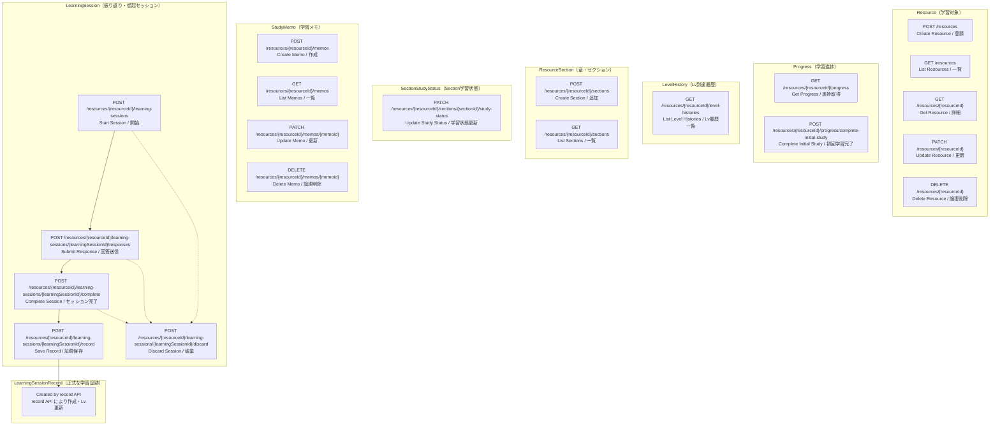

# 03-api-design.md

# SteerLog MVP API Design

## 目的

このドキュメントは、SteerLog MVPで実装するAPI仕様を定義する。  
Controller、Request DTO、Response DTO、Serviceの作成時は、この内容を基準にする。

MVPでは、Resource登録からLv.1〜Lv.3の学習証跡作成までをAPIで実現する。

---

# 0. 実装状況サマリ（2026-06-11）

| 分類 | API | 状態 |
|------|-----|------|
| Resource | POST/GET/GET詳細/PATCH/DELETE `/resources` | ✅ 実装済み |
| Progress | GET `/resources/{resourceId}/progress` | ✅ 実装済み |
| Progress | POST `.../progress/complete-initial-study` | ✅ 実装済み |
| Progress | PATCH `/resources/{resourceId}/progress` | ⬜ 未実装 |
| ResourceSection | POST/GET `/resources/{resourceId}/sections` | ✅ 実装済み |
| ResourceSection | PATCH/DELETE `.../sections/{sectionId}` | ⬜ 未実装 |
| SectionStudyStatus | PATCH `.../sections/{sectionId}/study-status` | ✅ 実装済み |
| SectionStudyStatus | GET `.../sections/{sectionId}/study-status` | ⬜ 未実装 |
| StudyMemo | POST/GET/PATCH/DELETE `/resources/{resourceId}/memos` | ✅ 実装済み |
| StudyMemo | GET `.../memos/{memoId}` | ⬜ 未実装 |
| LevelHistory | GET `/resources/{resourceId}/level-histories` | ✅ 実装済み |
| LearningSession | POST `.../learning-sessions`（start） | ✅ 実装済み |
| LearningSession | POST `.../learning-sessions/{id}/discard` | ✅ 実装済み |
| LearningSession | POST `.../learning-sessions/{id}/responses` | ✅ 実装済み |
| LearningSession | POST `.../learning-sessions/{id}/complete` | ✅ 実装済み |
| LearningSession | POST `.../learning-sessions/{id}/record` | ✅ 実装済み |
| LearningSessionRecord | record API 経由で保存 + Lv.2/Lv.3 到達 | ✅ 実装済み |

認証は未実装。Controller では `TEMP_USER_ID = 1L` 固定。

Resource詳細（`GET /resources/{resourceId}`）は現状 **Resource + Progress のみ**。Sections / Memos / LevelHistories の統合表示は Phase 8 予定。

---

# 0.5 API全体マップ

SteerLog MVP の全 API をドメイン単位で俯瞰するための図。  
各ボックスは **HTTP メソッド + パス** と **英語名 / 日本語補足** を示す。  
`{resourceId}` 配下の API は、いずれも対象 Resource が現在ユーザーのものであることを前提とする。

## 図の読み方

- **subgraph（枠）** … ドメイン（データのまとまり）ごとに API をグループ化している
- **実線矢印** … LearningSession の推奨フロー（start → responses → complete → record）
- **点線矢印** … discard は IN_PROGRESS / COMPLETED の任意タイミングで実行可能
- **POST /resources** … Resource 登録と同時に Progress が自動作成される（Progress の直接 POST はない）
- **record** … LearningSessionRecord（正式な学習証跡）を保存し、Lv.2 / Lv.3 到達処理を行う



LearningSession の典型的な流れ:

```text
start (IN_PROGRESS)
  → responses × (totalSteps - 1) 回
  → complete (COMPLETED, resultDraft はレスポンスのみ)
  → record (RECORD_SAVED, LearningSessionRecord 正式保存 + Lv.2/Lv.3 到達)

任意タイミング: discard（IN_PROGRESS / COMPLETED → DISCARDED）
```

sessionType による違い:

| sessionType | 意味 | record 保存時の Lv |
|-------------|------|-------------------|
| IMMEDIATE_REFLECTION | 学習直後の振り返り | Lv.2 到達候補 |
| DELAYED_RECALL | 時間を置いた想起（開始には Lv.2 以上が必要） | Lv.3 到達候補 |

---

# 1. API全体方針

## 1.1 API分類

MVPのAPIは、以下に分ける。

```text
Resource API
ResourceSection API
Progress API
SectionStudyStatus API
StudyMemo API
LearningSession API
LearningSessionRecord保存API
LevelHistory参照API
```

---

## 1.2 直接CRUDしないもの

以下は通常CRUD対象にしない。

```text
Progress作成
LearningSessionRecord直接CRUD
LevelHistory直接CRUD
```

理由：

```text
ProgressはResource作成時に自動作成する
LearningSessionRecordはLearningSessionのrecord処理で作成する
LevelHistoryはLevel到達処理の結果として作成する
```

---

## 1.3 認可方針

すべてのAPIで、対象データが現在ユーザーのものであることを確認する。

実装初期は仮userIdでもよいが、Service/Repositoryでは必ず `user_id` を検索条件に含める。

```sql
WHERE resource_id = :resourceId
  AND user_id = :userId
```

論理削除対象では以下も見る。

```sql
AND deleted_at IS NULL
```

---

# 2. Resource API

## 2.1 Resource登録

**状態: ✅ 実装済み**

```http
POST /resources
```

### 役割

学習対象を登録する。  
同時にProgressを `NOT_STARTED` で作成する。

### Request

```json
{
  "resourceType": "BOOK",
  "title": "Webを支える技術",
  "author": "山本陽平",
  "sourceUrl": null,
  "description": "REST/API設計の基礎を学ぶための本"
}
```

### 処理

```text
1. Resourceを作成
2. Progressを作成
   status = NOT_STARTED
   currentLevel = 0
3. Resource詳細を返す
```

### 注意

Progress作成APIは別で作らない。  
Resource作成とProgress作成は同一トランザクションで行う。

---

## 2.2 Resource一覧

**状態: ✅ 実装済み**（Query パラメータは未対応）

```http
GET /resources
```

### Query

⬜ 未実装。将来候補：

```text
status
resourceType
page
size
keyword
tag
currentLevel
```

### Responseに含める候補

```text
resourceId
resourceType
title
author
sourceUrl
progress.status
progress.currentLevel
progress.lastStudiedAt
createdAt
updatedAt
```

---

## 2.3 Resource詳細

**状態: ✅ 実装済み**（Resource + Progress のみ）

```http
GET /resources/{resourceId}
```

### Responseに含めるもの

現状：

```text
Resource本体
Progress
```

Phase 8 で追加予定：

```text
Sections + StudyStatus
RecentMemos
LatestLearningSessionRecords
LevelHistories
```

### 注意

SectionStudyStatusはResource詳細でSectionと一緒に返すとよい。  
N+1取得に注意する。

---

## 2.4 Resource更新

**状態: ✅ 実装済み**

```http
PATCH /resources/{resourceId}
```

### 更新可能

```text
title
author
sourceUrl
description
```

`resourceType` は現状更新不可。

---

## 2.5 Resource削除

**状態: ✅ 実装済み**

```http
DELETE /resources/{resourceId}
```

### 処理

物理削除ではなく、論理削除。

```text
resources.deleted_at = now
```

関連データは消さない。  
通常画面ではResourceごと非表示にする。

---

# 3. ResourceSection API

## 3.1 Section追加

**状態: ✅ 実装済み**

```http
POST /resources/{resourceId}/sections
```

### Request

```json
{
  "title": "第1章 Webとは何か",
  "sectionOrder": 1
}
```

### 処理

```text
1. Resourceが自分のものか確認
2. ResourceSectionを作成
3. SectionStudyStatusを作成
   studiedAt = null
4. Sectionを返す
```

### 注意

Section作成とSectionStudyStatus作成は同一トランザクションで行う。

---

## 3.2 Section一覧

**状態: ✅ 実装済み**

```http
GET /resources/{resourceId}/sections
```

### Response

Section の一覧（`sectionOrder` 昇順）。StudyStatus は含めない。

---

## 3.3 Section更新

**状態: ⬜ 未実装**

```http
PATCH /resources/{resourceId}/sections/{sectionId}
```

### 更新可能候補

```text
title
sectionOrder
```

注記：

```text
parentSectionId / displayOrder / level は現在の resource_sections には未実装
Section階層化や表示順の再設計が必要になった場合に再検討する
現時点では sectionOrder を使う
```

---

## 3.4 Section削除

**状態: ⬜ 未実装**

```http
DELETE /resources/{resourceId}/sections/{sectionId}
```

### 処理

物理削除ではなく、論理削除。

```text
resource_sections.deleted_at = now
```

SectionStudyStatusは消さない。  
削除済みSectionは通常表示しない。

---

# 4. Progress API

## 4.1 Progress取得

**状態: ✅ 実装済み**

```http
GET /resources/{resourceId}/progress
```

---

## 4.2 Progress更新

**状態: ⬜ 未実装**

```http
PATCH /resources/{resourceId}/progress
```

### 更新可能

```text
status
currentSectionId
archiveReason
```

### 更新不可

```text
currentLevel
initialStudiedAt
lastStudiedAt
completedAt
```

`currentLevel` はLevel到達処理で更新する。

---

## 4.3 status更新ルール

### NOT_STARTED → IN_PROGRESS

```text
status = IN_PROGRESS
started_at が null なら now
last_studied_at = now
```

### IN_PROGRESS → PAUSED

```text
status = PAUSED
updated_at = now
```

### PAUSED → IN_PROGRESS

```text
status = IN_PROGRESS
last_studied_at = now
```

### 任意状態 → ARCHIVED

```text
status = ARCHIVED
archived_at = now
archive_reason = 入力値。任意
```

### ARCHIVED → IN_PROGRESS / PAUSED / NOT_STARTED

```text
statusを変更
archived_atは残す
archive_reasonも残す
```

---

## 4.4 初回学習完了

**状態: ✅ 実装済み**

```http
POST /resources/{resourceId}/progress/complete-initial-study
```

### 役割

Resource全体を一通り学習済みにする。  
Lv.1到達候補にする。

### 処理

```text
1. Progress取得
2. initialStudiedAt = now
3. lastStudiedAt = now
4. status が NOT_STARTED なら IN_PROGRESS
5. currentLevel が1未満なら1に更新
6. LevelHistory Lv.1 がなければ作成
```

### LevelHistory

```text
level = 1
sourceType = INITIAL_STUDY_COMPLETION
sourceId = null
reasonCode = INITIAL_STUDY_COMPLETED
```

`currentLevel` は下げない。LevelHistory は重複作成しない。

---

# 5. SectionStudyStatus API

## 5.1 Section学習状態取得

**状態: ⬜ 未実装**

```http
GET /resources/{resourceId}/sections/{sectionId}/study-status
```

---

## 5.2 Section学習状態更新

**状態: ✅ 実装済み**

```http
PATCH /resources/{resourceId}/sections/{sectionId}/study-status
```

### Request

```json
{
  "studiedAt": "2026-05-26T21:00:00+09:00"
}
```

`studiedAt` が null の場合は更新しない（部分更新）。  
`understandingLevel` は ⬜ 未実装。

### 処理

```text
1. ResourceとSectionの所有者・親子関係を確認
2. SectionStudyStatus更新（studiedAt が指定された場合のみ）
3. Progress.status が NOT_STARTED なら IN_PROGRESS
4. Progress.lastStudiedAt / updatedAt = now
5. 未削除Sectionがすべて studiedAt ありなら Lv.1 自動到達
   currentLevel: 0 のときのみ 1
   initialStudiedAt: null のときのみセット
   LevelHistory 未存在時のみ作成
   sourceType = SECTION_STUDY_STATUS
   reasonCode = ALL_SECTIONS_STUDIED
```

Section が 0 件の Resource では Lv.1 自動到達しない。

### 自動更新しないもの

```text
Progress.currentSectionId
Progress.currentLevelの直接更新
Progress.completedAt
StudyMemo
```

---

# 6. StudyMemo API

## 6.1 メモ作成

**状態: ✅ 実装済み**

```http
POST /resources/{resourceId}/memos
```

### Request

```json
{
  "resourceSectionId": 10,
  "memoType": "QUESTION",
  "content": "PUTとPATCHの使い分けがまだ曖昧"
}
```

`memoType` が null の場合は `GENERAL`。`resourceSectionId` は任意。  
`tags` は ⬜ 未実装。

### 処理

```text
1. Resource所有者チェック
2. resourceSectionId 指定時、Section存在確認
3. StudyMemo作成
4. Progress.status が NOT_STARTED なら IN_PROGRESS
5. Progress.lastStudiedAt / updatedAt = now
```

StudyMemo作成では Level を上げない。LevelHistory / SectionStudyStatus は更新しない。

---

## 6.2 メモ一覧

**状態: ✅ 実装済み**

```http
GET /resources/{resourceId}/memos
```

### Query

⬜ 未実装（`sectionId` / `memoType` / ページング等）。

### Response

`createdAt` 降順。0 件は空配列。content 全文を返す（preview 形式は未採用）。

---

## 6.3 メモ詳細

**状態: ⬜ 未実装**

```http
GET /resources/{resourceId}/memos/{memoId}
```

---

## 6.4 メモ更新

**状態: ✅ 実装済み**

```http
PATCH /resources/{resourceId}/memos/{memoId}
```

### 更新可能

```text
memoType（null なら更新しない）
content（null なら更新しない、指定時 1〜500文字）
```

`resourceSectionId` / `tags` の更新は ⬜ 未実装。  
`updatedAt` は常に更新。Progress / LevelHistory は更新しない。

---

## 6.5 メモ削除

**状態: ✅ 実装済み**

```http
DELETE /resources/{resourceId}/memos/{memoId}
```

### 処理

論理削除。204 No Content。Progress / LevelHistory は更新しない。

---

# 7. LearningSession API

**状態: ✅ 実装済み（Phase 6〜7）**

LearningSession は Resource 配下の API として実装する。  
Controller のベースパスは `/resources/{resourceId}/learning-sessions`。

## 7.0 概要

### sessionType

```text
IMMEDIATE_REFLECTION  学習直後の振り返り（Lv.2 到達候補）
DELAYED_RECALL        時間を置いた想起（開始には Lv.2 以上が必要、Lv.3 到達候補）
```

### status

```text
IN_PROGRESS   セッション進行中
COMPLETED     全 step 回答済み・resultDraft 提示済み（Record 未保存）
RECORD_SAVED  LearningSessionRecord 保存済み
DISCARDED     破棄済み
```

### 典型的なフロー

```text
start (IN_PROGRESS, step=1)
  → responses × (totalSteps - 1) 回（step 進行、responseText は DB 非保存）
  → complete (COMPLETED, resultDraft はレスポンスのみ・DB 非保存)
  → record (RECORD_SAVED, LearningSessionRecord 正式保存 + Lv.2/Lv.3 到達)

任意タイミング: discard（IN_PROGRESS / COMPLETED → DISCARDED）
```

### MVP 簡略化（実装済みの制約）

```text
totalSteps = 3 固定
AI 未連携（aiPrompt / resultDraft は固定文言をレスポンスで返す）
learning_sessions テーブルに ai_prompt / result_draft / record_saved_at カラムはない
responseText は DB に正式保存しない
complete の Request Body は不要
record は Request 本文から LearningSessionRecord を作成する（complete の resultDraft をサーバー側で自動コピーしない）
userComment フィールドは未実装
```

### 例外一覧

| 例外コード | HTTP | 主な発生 API |
|-----------|------|-------------|
| `RESOURCE_NOT_FOUND` | 404 | start |
| `PROGRESS_NOT_FOUND` | 404 | start, record |
| `LEVEL_REQUIREMENT_NOT_MET` | 400 | start（DELAYED_RECALL） |
| `SESSION_ALREADY_IN_PROGRESS` | 409 | start |
| `LEARNING_SESSION_NOT_FOUND` | 404 | discard / responses / complete / record |
| `LEARNING_SESSION_CANNOT_BE_DISCARDED` | 400 | discard |
| `LEARNING_SESSION_CANNOT_ACCEPT_RESPONSE` | 400 | responses |
| `LEARNING_SESSION_CANNOT_BE_COMPLETED` | 400 | complete |
| `LEARNING_SESSION_RECORD_CANNOT_BE_SAVED` | 400 | record |

---

## 7.1 セッション開始

**状態: ✅ 実装済み**

```http
POST /resources/{resourceId}/learning-sessions
```

### Request

```json
{
  "sessionType": "IMMEDIATE_REFLECTION"
}
```

または、

```json
{
  "sessionType": "DELAYED_RECALL"
}
```

### 開始条件

```text
IMMEDIATE_REFLECTION:
  Resource が存在すれば開始可能

DELAYED_RECALL:
  Progress.currentLevel >= 2 の場合のみ開始可能
```

### 失敗例

```text
LEVEL_REQUIREMENT_NOT_MET
SESSION_ALREADY_IN_PROGRESS
```

### 処理

```text
1. Resource 所有者チェック
2. Progress 取得
3. DELAYED_RECALL なら currentLevel >= 2 を確認
4. 同一 userId + resourceId + sessionType で IN_PROGRESS / COMPLETED がないか確認
5. LearningSession 作成
   status = IN_PROGRESS
   currentStep = 1
   totalSteps = 3
6. 最初の aiPrompt をレスポンスで返す（DB 非保存）
```

### Response の nextAction

```json
{
  "type": "SUBMIT_RESPONSE"
}
```

---

## 7.2 回答送信

**状態: ✅ 実装済み**

```http
POST /resources/{resourceId}/learning-sessions/{learningSessionId}/responses
```

### 意味

回答を送信し、次の質問（aiPrompt）を取得する API。  
**回答本文は DB に正式保存しない。**

### Request

```json
{
  "responseText": "REST APIではリソースをURIで表現し..."
}
```

### 処理

```text
1. status = IN_PROGRESS を確認
2. currentStep < totalSteps を確認
3. currentStep を +1
4. 次の aiPrompt をレスポンスで返す（DB 非保存）
5. status は IN_PROGRESS のまま
```

### Response の nextAction

```text
最終 step 未到達: { "type": "SUBMIT_RESPONSE" }
最終 step 到達後: { "type": "COMPLETE_SESSION" }
```

---

## 7.3 セッション完了

**状態: ✅ 実装済み**

```http
POST /resources/{resourceId}/learning-sessions/{learningSessionId}/complete
```

Request Body は不要。

### 処理

```text
1. status = IN_PROGRESS を確認
2. currentStep == totalSteps を確認
3. status = COMPLETED
4. completedAt = now
5. resultDraft を固定テンプレートで生成しレスポンスで返す（DB 非保存）
```

### Response 例

```json
{
  "learningSessionId": 1,
  "resourceId": 10,
  "sessionType": "IMMEDIATE_REFLECTION",
  "status": "COMPLETED",
  "resultDraft": {
    "summary": "今回の振り返り内容をもとに、学習内容の要点を整理しました。",
    "conceptTags": ["reflection", "understanding", "review"],
    "weakPointSummary": "まだ曖昧な点は、次回の復習で確認してください。",
    "nextAction": "今回整理した内容をもとに、重要な概念をもう一度説明できるか確認してください。",
    "aiAssessment": "PASSED",
    "generationBasis": "MVPでは回答ログを保存しないため、固定テンプレートでresultDraftを生成しています。"
  },
  "nextAction": {
    "type": "SAVE_RECORD"
  },
  "completedAt": "2026-06-08T13:00:00Z"
}
```

---

## 7.4 Record 保存

**状態: ✅ 実装済み**（Lv.2 / Lv.3 到達処理含む）

```http
POST /resources/{resourceId}/learning-sessions/{learningSessionId}/record
```

### Request

クライアントが complete の resultDraft を参考に、保存内容を Request で送る。

```json
{
  "summary": "学習内容の要点まとめ",
  "conceptTags": ["reflection", "understanding"],
  "weakPointSummary": "まだ曖昧な点あり",
  "nextAction": "次回復習する",
  "aiAssessment": "PASSED"
}
```

`aiAssessment` の値:

```text
PASSED
NEEDS_REVIEW
OFF_TOPIC（保存不可）
```

`conceptTags` は Request/Response では `List<String>`、DB ではカンマ区切り `TEXT`。

### 処理

```text
1. LearningSession.status = COMPLETED を確認
2. aiAssessment != OFF_TOPIC を確認
3. 同一 LearningSession からの Record 重複がないことを確認
4. LearningSessionRecord 作成（Request 本文から）
5. LearningSession.status = RECORD_SAVED
6. Progress.lastStudiedAt / updatedAt = now
7. sessionType に応じて Lv 到達処理
   IMMEDIATE_REFLECTION → currentLevel が 2 未満なら 2、LevelHistory Lv.2 作成
   DELAYED_RECALL       → currentLevel が 3 未満なら 3、LevelHistory Lv.3 作成
8. currentLevel は下げない。LevelHistory は重複作成しない
```

### LevelHistory（record 保存時）

```text
Lv.2:
  level = 2
  sourceType = LEARNING_SESSION_RECORD
  sourceId = learningSessionRecordId
  reasonCode = IMMEDIATE_REFLECTION_RECORDED

Lv.3:
  level = 3
  sourceType = LEARNING_SESSION_RECORD
  sourceId = learningSessionRecordId
  reasonCode = DELAYED_RECALL_RECORDED
```

`PASSED` / `NEEDS_REVIEW` はいずれも Lv 到達対象。`OFF_TOPIC` は保存不可。

### 注意

complete の resultDraft をサーバー側で自動コピーしない。  
クライアントが Request で Record 内容を送る。

---

## 7.5 破棄

**状態: ✅ 実装済み**

```http
POST /resources/{resourceId}/learning-sessions/{learningSessionId}/discard
```

Request Body は不要。

### 処理

```text
1. status が IN_PROGRESS または COMPLETED であることを確認
2. status = DISCARDED
3. updatedAt = now
4. completedAt は変更しない
```

### 効果

```text
LearningSessionRecord は作らない
Progress.currentLevel は上げない
LevelHistory は作らない
```

---

# 8. LevelHistory API

## 8.1 LevelHistory一覧

**状態: ✅ 実装済み**

```http
GET /resources/{resourceId}/level-histories
```

`createdAt` 昇順。0 件は空配列。

### Response

```text
level
sourceType
sourceId
reasonCode
createdAt
```

LevelHistoryは直接作成・更新・削除しない。

---

# 9. 作らないAPI

MVPでは以下を作らない。

```text
POST /progresses
POST /learning-session-records
PATCH /learning-session-records/{id}
DELETE /learning-session-records/{id}
POST /level-histories
PATCH /level-histories/{id}
DELETE /level-histories/{id}
POST /check-records
POST /answers
POST /review-records
```

---

# 10. まとめ

現時点（Phase 7 まで完了、Phase 8 未着手）で実装済みの主な流れ：

```text
Resource登録 → Progress自動作成
Section追加 → SectionStudyStatus自動作成
Section学習済み更新 → Progress更新 → 全Section完了でLv.1
complete-initial-study → Lv.1（別経路）
StudyMemo CRUD → Progress.lastStudiedAt更新（Levelは上がらない）
LearningSession start → responses → complete → record
  IMMEDIATE_REFLECTION record 保存 → Lv.2
  DELAYED_RECALL record 保存 → Lv.3
LevelHistory参照
```

未実装の主な項目（MVP 内）：

```text
PATCH /resources/{resourceId}/progress
PATCH/DELETE /resources/{resourceId}/sections/{sectionId}
GET /resources/{resourceId}/sections/{sectionId}/study-status
GET /resources/{resourceId}/memos/{memoId}
Resource詳細の統合表示（Sections / Memos / LatestRecords 等）
AI連携（aiPrompt / resultDraft の動的生成）
```

MVP API全体の重要な原則：

```text
ProgressはResource作成時に自動作成
SectionStudyStatusはSection作成時に自動作成
StudyMemoではLevelを上げない
LearningSessionRecordはrecord APIで保存前確認後に作る
LevelHistoryはLevel到達処理で作る
currentLevelは専用到達処理でのみ更新（外部から直接更新しない）
raw回答ログ（responseText）は正式保存しない
completeのresultDraftはDB非保存。recordはRequest本文から作成する
```
