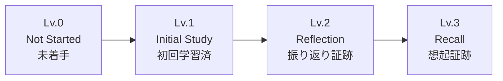
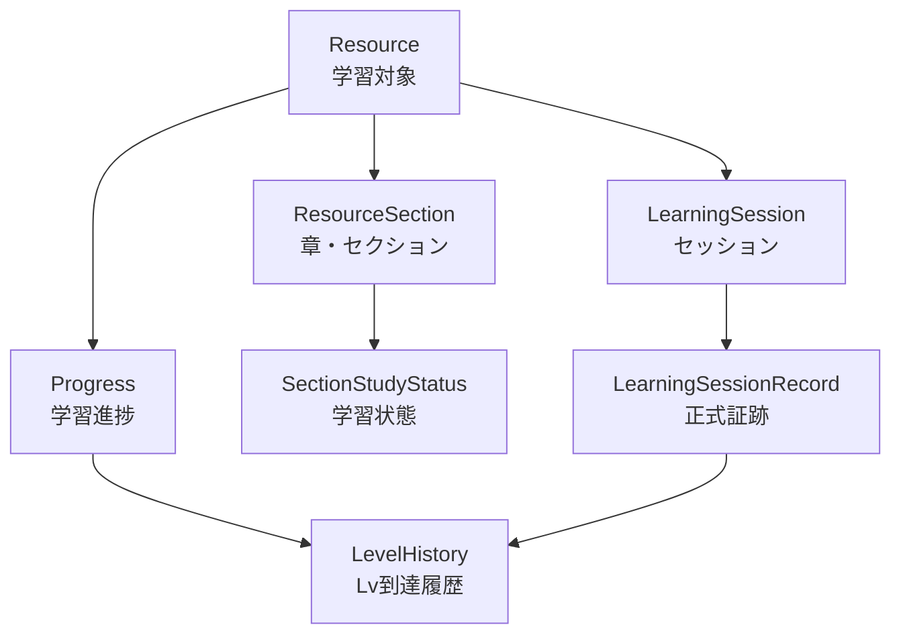
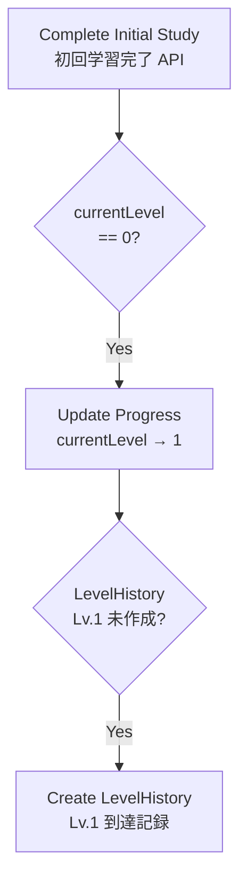
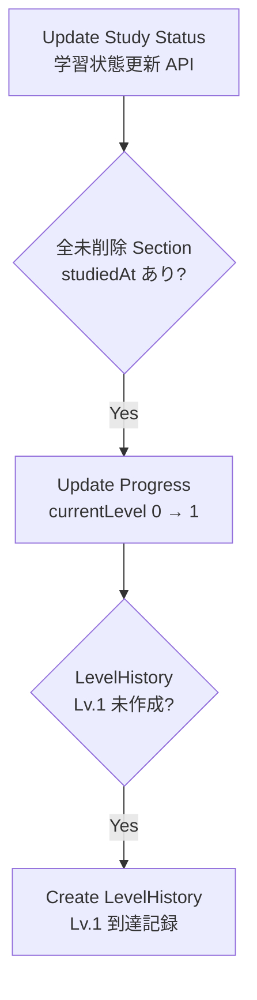
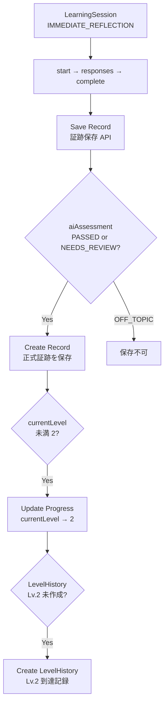
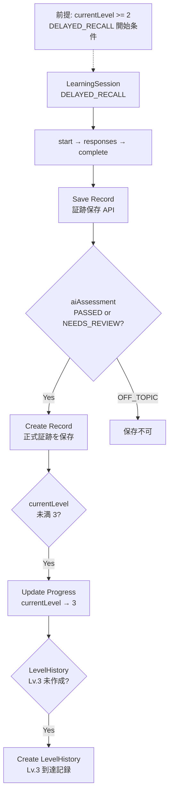

# 04-level-rules.md

# SteerLog Level Rules

## 目的

このドキュメントは、SteerLog MVPにおけるLv.1〜Lv.3の意味、到達条件、Progress更新、LevelHistory作成ルールを定義する。

AIコード生成、Service実装、テスト作成では、この内容を基準にする。

---

# 0. 実装状況（2026-06-11）

| 項目 | 状態 |
|------|------|
| Lv.1 明示到達（complete-initial-study） | ✅ 実装済み |
| Lv.1 自動到達（全Section studiedAt） | ✅ 実装済み |
| Lv.2 到達（IMMEDIATE_REFLECTION record） | ✅ 実装済み |
| Lv.3 到達（DELAYED_RECALL record） | ✅ 実装済み |
| LevelHistory GET | ✅ 実装済み |
| LevelHistory 重複防止 | ✅ 実装済み |
| currentLevel 下げない | ✅ 実装済み |
| StudyMemo 作成時の Progress 更新 | ✅ 実装済み |
| StudyMemo 作成で Level 上げない | ✅ 実装済み |

---

# 1. Levelの基本思想

SteerLogのLevelは、理解保証ではなく **証跡段階** である。

```text
Level = そのResourceに対して、どの種類の学習証跡が存在するか
```

であり、

```text
Level = その技術を完全に理解した証明
```

ではない。

そのため、`NEEDS_REVIEW` のLearningSessionRecordでも、対象Resourceに関係する有効な証跡であれば、Lv.2 / Lv.3の到達候補になる。

ただし、UIでは `PASSED` と `NEEDS_REVIEW` を区別して表示する。

---

# 2. Level一覧

MVPで実装するのはLv.1〜Lv.3。

| Level | 意味 | MVP |
|---:|---|---|
| Lv.1 | 初回学習済み / 一通り触れた状態 | ○ |
| Lv.2 | Immediate Reflectionの正式証跡あり | ○ |
| Lv.3 | Delayed Recallの正式証跡あり | ○ |
| Lv.4 | Artifact / 成果物による証跡 | MVP外 |
| Lv.5 | Defense / 説明・防衛できる状態 | MVP外 |

DB上の `current_level` と `level_histories.level` は、将来拡張を見据えて0〜5または1〜5を許容する。

---

# 2.5 Level到達フロー図

Lv.1〜Lv.3 の到達ルートと、`Progress` / `LevelHistory` 更新の流れを俯瞰するための図。  
情報量が多いため **5枚に分割** している。各ルートの詳細は §3〜§5 を参照。

## 図の読み方

- **菱形** … 条件の確認（満たさなければ Lv 更新・LevelHistory 作成は行わない）
- **矩形** … `Progress` または `LevelHistory` の更新処理
- **点線** … 前提条件（例: Lv.2 到達後にのみ `DELAYED_RECALL` を開始可能）
- 条件を満たさない場合は **何もしない**（`currentLevel` を下げることはない）
- 図内のラベルは短くしている。API パスや `reasonCode` の詳細は各図の直下の表を参照

### 共通ルール

- **`Progress.currentLevel` は到達済み Lv より低い値に戻さない**
- **`LevelHistory` は「初めてその Lv に到達した履歴」**。同じ `userId + resourceId + level` は重複作成しない
- **`OFF_TOPIC` の Record は保存不可** のため、Lv.2 / Lv.3 の到達対象外
- **`StudyMemo` の作成・更新・削除では Lv は上げない**（`lastStudiedAt` のみ更新）

---

## 図1: Level全体像 / Level Overview

MVP で扱う Lv の段階と、到達の大まかな順序。



| Level | 到達トリガー（概要） |
|------|---------------------|
| Lv.1 | 初回学習完了 API **または** 全 Section 学習済み |
| Lv.2 | `IMMEDIATE_REFLECTION` の Record 保存 |
| Lv.3 | `DELAYED_RECALL` の Record 保存（開始には Lv.2 以上が必要） |

---

## 図2: 主要ドメインの関係 / Entity Map

Level 到達処理で関わるドメインのつながり。



---

## 図3: Lv.1 到達ルート / Lv.1 Achievement

Lv.1 には **2つの独立したルート** がある。どちらも `currentLevel == 0` のときのみ 1 に更新する（既に 1 以上なら下げない）。

### Route A: 初回学習完了



| 項目 | 値 |
|------|-----|
| API | `POST /resources/{resourceId}/progress/complete-initial-study` |
| reasonCode | `INITIAL_STUDY_COMPLETED` |
| sourceType | `INITIAL_STUDY_COMPLETION` |

### Route B: 全 Section 学習済み



| 項目 | 値 |
|------|-----|
| API | `PATCH /resources/{resourceId}/sections/{sectionId}/study-status` |
| reasonCode | `ALL_SECTIONS_STUDIED` |
| sourceType | `SECTION_STUDY_STATUS` |
| 注意 | Section が 0 件の Resource では自動到達しない |

---

## 図4: Lv.2 到達ルート / Lv.2 Achievement

`IMMEDIATE_REFLECTION` セッション完了後、Record を保存すると Lv.2 到達候補になる。



| 項目 | 値 |
|------|-----|
| API | `POST /resources/{resourceId}/learning-sessions/{learningSessionId}/record` |
| sessionType | `IMMEDIATE_REFLECTION` |
| reasonCode | `IMMEDIATE_REFLECTION_RECORDED` |
| sourceType | `LEARNING_SESSION_RECORD` |
| sourceId | `learningSessionRecordId` |

---

## 図5: Lv.3 到達ルート / Lv.3 Achievement

`DELAYED_RECALL` は **Lv.2 到達後** にのみセッション開始可能。Record 保存で Lv.3 到達候補になる。



| 項目 | 値 |
|------|-----|
| API | `POST /resources/{resourceId}/learning-sessions/{learningSessionId}/record` |
| sessionType | `DELAYED_RECALL` |
| reasonCode | `DELAYED_RECALL_RECORDED` |
| sourceType | `LEARNING_SESSION_RECORD` |
| sourceId | `learningSessionRecordId` |
| 開始条件 | `Progress.currentLevel >= 2`（未満なら `LEVEL_REQUIREMENT_NOT_MET`） |

---

# 3. Lv.1

## 3.1 意味

```text
初回学習済み / 一通り触れた状態
```

Lv.1は完全理解ではない。  
初回学習によってResourceの全体像に触れた状態を表す。

---

## 3.2 到達ルート

Lv.1到達ルートは2つ。

```text
1. Resource全体を一通り学習済みにする
2. 全SectionのstudiedAtが埋まる
```

---

## 3.3 Resource全体を一通り学習済みにする

**状態: ✅ 実装済み**

API：

```http
POST /resources/{resourceId}/progress/complete-initial-study
```

処理：

```text
1. Progressを取得
2. Progress.initialStudiedAt = now
3. Progress.lastStudiedAt = now
4. Progress.status が NOT_STARTED なら IN_PROGRESS
5. Progress.currentLevel が 0 なら 1 に更新
6. LevelHistory Lv.1 がなければ作成
```

LevelHistory：

```text
level = 1
sourceType = INITIAL_STUDY_COMPLETION
sourceId = null
reasonCode = INITIAL_STUDY_COMPLETED
```

`currentLevel` は 0 のときのみ 1 に更新。既に 1 以上なら下げない。

注意：

```text
この操作では、各SectionStudyStatus.studiedAtを自動で埋めない。
```

理由：

```text
Resource全体を一通り触った自己申告
Sectionごとの個別学習済み証跡
```

は分けるため。

---

## 3.4 全Section学習済みによるLv.1

**状態: ✅ 実装済み**

SectionStudyStatus更新後、**未削除Section** がすべて `studiedAt IS NOT NULL` になった場合、Lv.1到達候補にする。Section が 0 件の Resource では自動到達しない。

処理：

```text
1. SectionStudyStatus更新
2. Progress.status が NOT_STARTED なら IN_PROGRESS
3. Progress.lastStudiedAt / updatedAt = now
4. 未削除SectionのstudiedAtを確認
5. 全Section学習済みなら currentLevel を 0 のときのみ 1
6. initialStudiedAt が null ならセット
7. LevelHistory Lv.1 がなければ作成
```

LevelHistory：

```text
level = 1
sourceType = SECTION_STUDY_STATUS
sourceId = null
reasonCode = ALL_SECTIONS_STUDIED
```

---

# 4. Lv.2

**状態: ✅ 実装済み**

## 4.1 意味

```text
Immediate Reflectionの正式証跡がある状態
```

学習直後に、そのResourceについて自分の言葉で振り返った証跡がある状態。

Lv.2は完全理解を意味しない。  
Immediate ReflectionのLearningSessionRecordが保存された状態を意味する。

---

## 4.2 到達条件

以下を満たす場合、Lv.2到達候補にする。

```text
sessionType = IMMEDIATE_REFLECTION
LearningSessionRecordが保存される（record API、Request本文から作成）
aiAssessment = PASSED または NEEDS_REVIEW（OFF_TOPIC は保存不可）
```

---

## 4.3 処理

`LearningSessionService#saveRecord` 内で、同一トランザクションとして以下を行う。

```text
1. LearningSession.status = COMPLETED を確認
2. aiAssessment != OFF_TOPIC を確認
3. 同一 LearningSession からの Record 重複がないことを確認
4. LearningSessionRecord作成（Request本文: summary / conceptTags / aiAssessment 等）
5. LearningSession.status = RECORD_SAVED、updatedAt = now
6. Progress.lastStudiedAt / updatedAt = now
7. Progress.currentLevel が2未満なら2に更新（下げない）
8. LevelHistory Lv.2 がなければ作成
```

LevelHistory：

```text
level = 2
sourceType = LEARNING_SESSION_RECORD
sourceId = learningSessionRecordId
reasonCode = IMMEDIATE_REFLECTION_RECORDED
```

MVP 簡略化：

```text
learning_sessions に record_saved_at カラムはない
complete の resultDraft をサーバー側で自動コピーしない（クライアントが Request で送る）
```

---

# 5. Lv.3

**状態: ✅ 実装済み**

## 5.1 意味

```text
Delayed Recallの正式証跡がある状態
```

時間を置いて、そのResourceについて思い出す・説明する証跡がある状態。

Lv.3も完全理解を意味しない。  
Delayed RecallのLearningSessionRecordが保存された状態を意味する。

---

## 5.2 開始条件

DELAYED_RECALLのLearningSessionは、Lv.2到達済みでなければ開始できない。

```text
Progress.currentLevel >= 2
```

満たさない場合：

```text
LEVEL_REQUIREMENT_NOT_MET
```

---

## 5.3 到達条件

以下を満たす場合、Lv.3到達候補にする。

```text
sessionType = DELAYED_RECALL
LearningSessionRecordが保存される（record API、Request本文から作成）
aiAssessment = PASSED または NEEDS_REVIEW（OFF_TOPIC は保存不可）
```

※ セッション開始時点で `Progress.currentLevel >= 2` が必要（`LEVEL_REQUIREMENT_NOT_MET`）。  
record 保存時の Lv.3 到達処理自体は `currentLevel < 3` の更新判定のみ。

---

## 5.4 処理

`LearningSessionService#saveRecord` 内で、同一トランザクションとして以下を行う。

```text
1. LearningSession.status = COMPLETED を確認
2. aiAssessment != OFF_TOPIC を確認
3. 同一 LearningSession からの Record 重複がないことを確認
4. LearningSessionRecord作成（Request本文: summary / conceptTags / aiAssessment 等）
5. LearningSession.status = RECORD_SAVED、updatedAt = now
6. Progress.lastStudiedAt / updatedAt = now
7. Progress.currentLevel が3未満なら3に更新（下げない）
8. LevelHistory Lv.3 がなければ作成
```

LevelHistory：

```text
level = 3
sourceType = LEARNING_SESSION_RECORD
sourceId = learningSessionRecordId
reasonCode = DELAYED_RECALL_RECORDED
```

MVP 簡略化は Lv.2（§4.3）と同様。

---

# 6. aiAssessmentの扱い

## 6.1 値

```text
PASSED
NEEDS_REVIEW
OFF_TOPIC
```

---

## 6.2 PASSED

対象Resourceについて、自分の言葉である程度説明できている状態。

例：

```text
具体例を使って説明できている
自分の実装・設計に接続できている
概念の関係を説明できている
```

Level到達候補になる。

---

## 6.3 NEEDS_REVIEW

対象Resourceに関係する回答ではあるが、浅い・曖昧・混乱がある状態。

例：

```text
説明が抽象的
具体例が弱い
用語の使い分けが曖昧
一部誤解がある
```

Level到達候補になる。

理由：

```text
SteerLogのLevelは理解保証ではなく証跡段階だから。
```

ただし、UIでは「要復習あり」として表示する。

---

## 6.4 OFF_TOPIC

対象Resourceの証跡として無効な状態。

例：

```text
回答がResourceと関係ない
短すぎて判断できない
読んでいない/分からないだけ
質問に答えていない
```

Level到達候補にしない。  
実装では `OFF_TOPIC` の `LearningSessionRecord` 保存自体が不可（`LEARNING_SESSION_RECORD_CANNOT_BE_SAVED`）。

---

# 7. LevelHistory

## 7.1 役割

LevelHistoryは、各Levelに初めて到達した履歴である。

```text
LevelHistory = 初到達イベント
LearningSessionRecord = 証跡本文
```

---

## 7.2 一意制約

同じResource・同じLevelのLevelHistoryは1件だけ。

```text
userId + resourceId + level
```

で一意。

実装で使用する `reasonCode`：

| level | reasonCode | sourceType |
|------:|------------|------------|
| 1 | `INITIAL_STUDY_COMPLETED` | `INITIAL_STUDY_COMPLETION` |
| 1 | `ALL_SECTIONS_STUDIED` | `SECTION_STUDY_STATUS` |
| 2 | `IMMEDIATE_REFLECTION_RECORDED` | `LEARNING_SESSION_RECORD` |
| 3 | `DELAYED_RECALL_RECORDED` | `LEARNING_SESSION_RECORD` |

※ DB の CHECK 制約には旧設計の `IMMEDIATE_REFLECTION_RECORD_SAVED` / `DELAYED_RECALL_RECORD_SAVED` も許容しているが、現行実装は上記 `*_RECORDED` を使用する。

---

## 7.3 追加証跡の扱い

すでにLv.2到達済みのResourceに対して、追加でIMMEDIATE_REFLECTIONを保存した場合：

```text
LearningSessionRecordは作成する
LevelHistory Lv.2は追加しない
Progress.currentLevelは変わらない
```

同じく、すでにLv.3到達済みのResourceに対して、追加でDELAYED_RECALLを保存した場合も、LevelHistoryは増やさない。

---

# 8. Levelを下げない方針

MVPでは、一度到達したLevelは通常操作では下げない。

例：

```text
SectionStudyStatus.studiedAtをnullに戻す
StudyMemoを削除する
Progress.statusをPAUSEDにする
```

こうした操作をしても、すでに作成されたLevelHistoryは削除しない。  
Progress.currentLevelも原則下げない。

理由：

```text
LevelHistoryは過去の初到達履歴だから。
```

---

# 9. currentLevel直接更新禁止

`Progress.currentLevel` は、外部APIから直接更新させない。

禁止：

```text
PATCH /resources/{resourceId}/progress
{
  "currentLevel": 2
}
```

currentLevelは以下の処理だけで更新する。

```text
POST .../progress/complete-initial-study（Lv.1、currentLevel == 0 のときのみ 1）
PATCH .../sections/{sectionId}/study-status（全Section学習済み時、Lv.1、currentLevel == 0 のときのみ 1）
POST .../learning-sessions/{id}/record（Lv.2 / Lv.3、currentLevel < targetLevel のとき更新）
```

---

# 10. トランザクション

以下は必ずトランザクションで処理する。

```text
complete-initial-study + Progress更新 + LevelHistory作成
SectionStudyStatus更新 + Lv.1判定 + Progress更新 + LevelHistory作成
LearningSessionRecord保存 + LearningSession更新 + Progress更新 + LevelHistory作成
```

---

# 11. 旧方針として採用しないもの

MVPでは以下を採用しない。

```text
正答率でLv.3判定
AIクイズのスコアでLevelを上げる
CheckRecordでLevelを判定する
ReviewRecordでLevelを判定する
StudyMemo作成でLevelを上げる
ユーザーがcurrentLevelを直接更新する
```

---

# 12. StudyMemoとLevel（実装済み）

StudyMemo 作成時：

```text
Progress.status: NOT_STARTED → IN_PROGRESS
Progress.lastStudiedAt / updatedAt = now
currentLevel / initialStudiedAt / LevelHistory は更新しない
SectionStudyStatus は更新しない
```

StudyMemo 更新・削除時は Progress / LevelHistory を更新しない。

---

# 13. まとめ

現時点（Phase 7 まで完了）で動いている Level 設計：

```text
Lv.0 = Resource作成直後（Progress自動作成）
Lv.1 = 初回学習済み / 一通り触れた（2経路: complete-initial-study / 全Section自動）
Lv.2 = Immediate Reflectionの正式証跡あり（IMMEDIATE_REFLECTION record 保存）
Lv.3 = Delayed Recallの正式証跡あり（DELAYED_RECALL record 保存）
```

Levelは理解保証ではなく証跡段階。  
LevelHistoryは初到達履歴（`userId + resourceId + level` で重複不可）。  
LearningSessionRecordは record API で作成する正式証跡本文。  
`currentLevel` は Level 到達処理でのみ更新し、外部 API から直接更新しない。  
`PASSED` / `NEEDS_REVIEW` は Lv.2/Lv.3 到達対象。`OFF_TOPIC` は Record 保存不可。

未実装（MVP 内・Level 周辺）：

```text
PATCH /resources/{resourceId}/progress（status 等の手動更新）
AI連携による aiAssessment / resultDraft の動的生成
Lv.4 / Lv.5
```
