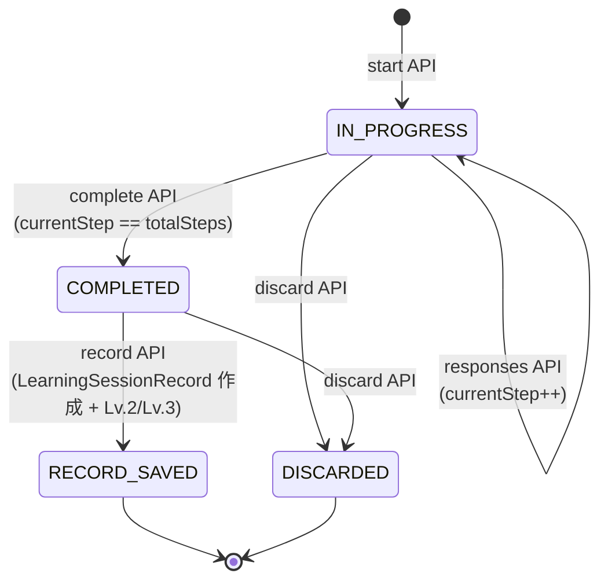
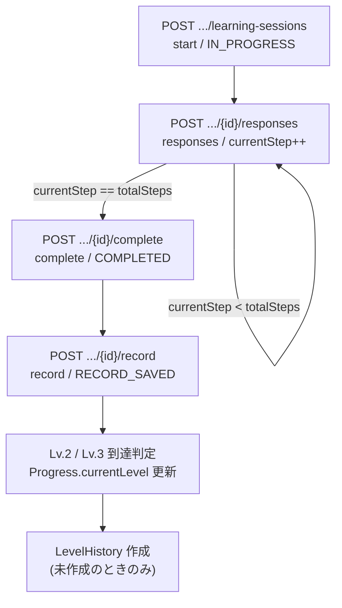
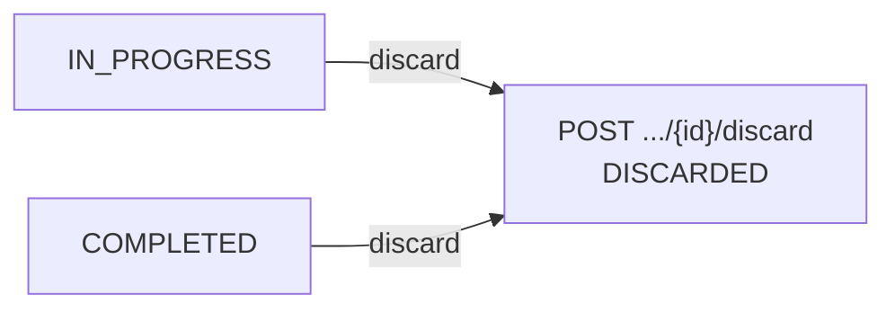

# 05-learning-session-flow.md

# SteerLog LearningSession Flow

## 目的

このドキュメントは、SteerLog MVP における LearningSession / LearningSessionRecord の状態遷移、API フロー、保存するもの/しないもの、raw ログ非保存方針を定義する。

LearningSession 実装、Service、Controller、DTO、テスト作成時は、この内容を基準にする。

> **実装状況（2026-06-11）**: start / responses / complete / record / discard はすべて実装済み。Lv.2 / Lv.3 到達処理も実装済み。AI は未連携で、`aiPrompt` / `resultDraft` は固定文言。

---

# 1. LearningSessionの役割

LearningSession は、Reflection / Recall の実行単位である。

LearningSession は正式証跡ではない。  
正式証跡は、ユーザーが保存した `LearningSessionRecord` である。

```text
learning_sessions
= セッションの進行状態

learning_session_records
= 保存された正式な学習証跡
```

---

# 2. MVPでの対象

MVP では LearningSession は Resource 単位で実行する。  
API もすべて Resource 配下に統一されている。

```text
対象 = Resource
ベースパス = /resources/{resourceId}/learning-sessions
```

Section 単位の LearningSession は MVP では実装しない。

理由：

```text
MVPではSection学習状態はSectionStudyStatusとStudyMemoで扱う
LearningSessionはLv.2 / Lv.3のResource-wide証跡にする
```

---

# 3. sessionType

MVP では2種類。

```text
IMMEDIATE_REFLECTION
DELAYED_RECALL
```

## 3.1 IMMEDIATE_REFLECTION

学習直後の振り返り。

```text
Lv.2に関係する
学習内容を自分の言葉で説明する
record保存でLv.2到達候補になる
```

## 3.2 DELAYED_RECALL

時間を置いた想起。

```text
Lv.3に関係する
時間が経っても思い出せるかを確認する
Lv.2到達後（currentLevel >= 2）でなければ開始できない
record保存でLv.3到達候補になる
```

---

# 4. status

LearningSession.status は以下。

```text
IN_PROGRESS
COMPLETED
RECORD_SAVED
DISCARDED
```

## 4.1 IN_PROGRESS

回答中。

許可操作：

```text
responses
complete
discard
```

## 4.2 COMPLETED

全 step 回答済み。`resultDraft` をレスポンスで提示済み（DB 非保存）。  
ユーザーの保存判断待ち。

許可操作：

```text
record
discard
```

## 4.3 RECORD_SAVED

ユーザーが保存し、`LearningSessionRecord` を作成済み。

終端状態。

## 4.4 DISCARDED

ユーザーが破棄した状態。

終端状態。  
Level 更新なし。  
LearningSessionRecord なし。

---

# 5. 状態遷移



補足：

- `responses` は `IN_PROGRESS` のまま `currentStep` を進めるだけ（自己遷移）
- `complete` は `currentStep == totalSteps` のときのみ可能
- `discard` は `IN_PROGRESS` / `COMPLETED` からのみ可能。`RECORD_SAVED` / `DISCARDED` からは不可
- `RECORD_SAVED` / `DISCARDED` は終端状態（以降の遷移なし）

---

# 6. APIフロー

## 6.1 通常フロー（保存まで）



## 6.2 破棄フロー（分岐）



`RECORD_SAVED` / `DISCARDED` からは `discard` 不可（`LEARNING_SESSION_CANNOT_BE_DISCARDED`）。

---

# 7. 保存するもの / 保存しないもの

SteerLog はチャットログ保存アプリではない。raw 回答や AI 会話ログは正式保存しない。

## 7.1 保存するもの

| 対象 | 内容 |
|------|------|
| `LearningSession` | `status` / `currentStep` / `totalSteps` / `startedAt` / `completedAt` / `updatedAt` |
| `LearningSessionRecord` | record API で作成する正式証跡（`summary` / `conceptTags` / `weakPointSummary` / `nextAction` / `aiAssessment` 等） |
| `Progress` | record 到達時の `currentLevel` / `lastStudiedAt` / `updatedAt` |
| `LevelHistory` | Lv.2 / Lv.3 の初到達履歴 |

## 7.2 保存しないもの

| 対象 | 備考 |
|------|------|
| responses API の raw 回答本文（`responseText`） | AI 生成の入力に使うのみ。DB 非保存 |
| complete API の `resultDraft` | レスポンスでのみ返す。DB 非保存 |
| AI との会話ログ全文 / AI 質問履歴全文 | 正式保存しない |
| `recordSavedAt` / `discardedAt` 専用カラム | MVP では持たない（`updatedAt` で代替） |

---

# 8. APIフロー詳細

## 8.1 セッション開始

```http
POST /resources/{resourceId}/learning-sessions
```

Request：

```json
{
  "sessionType": "IMMEDIATE_REFLECTION"
}
```

処理：

```text
1. Resource所有者チェック（未存在/他人/論理削除 → RESOURCE_NOT_FOUND）
2. Progress取得（未存在 → PROGRESS_NOT_FOUND）
3. DELAYED_RECALLならProgress.currentLevel >= 2を確認（未満 → LEVEL_REQUIREMENT_NOT_MET）
4. 同一userId + resourceId + sessionTypeでIN_PROGRESS/COMPLETEDがないか確認（あり → SESSION_ALREADY_IN_PROGRESS）
5. LearningSession作成（status = IN_PROGRESS, currentStep = 1, totalSteps = 3）
6. 最初のaiPromptをレスポンスで返す（DB非保存）
```

`nextAction.type = SUBMIT_RESPONSE`

---

## 8.2 responses

```http
POST /resources/{resourceId}/learning-sessions/{learningSessionId}/responses
```

役割：

```text
回答を送信し、次のaiPromptを取得する。回答本文はDBに正式保存しない。
```

Request：

```json
{
  "responseText": "REST APIではリソースをURIで表現し..."
}
```

処理：

```text
1. status = IN_PROGRESS を確認（それ以外 → LEARNING_SESSION_CANNOT_ACCEPT_RESPONSE）
2. currentStep < totalSteps を確認（最終step到達済み → LEARNING_SESSION_CANNOT_ACCEPT_RESPONSE）
3. currentStep を +1
4. status は IN_PROGRESS のまま
5. 次のaiPromptをレスポンスで返す（DB非保存）
```

`nextAction.type`：

```text
最終step未到達: SUBMIT_RESPONSE
最終step到達後: COMPLETE_SESSION
```

---

## 8.3 complete

```http
POST /resources/{resourceId}/learning-sessions/{learningSessionId}/complete
```

Request Body は不要。

処理：

```text
1. status = IN_PROGRESS を確認（それ以外 → LEARNING_SESSION_CANNOT_BE_COMPLETED）
2. currentStep == totalSteps を確認（未到達 → LEARNING_SESSION_CANNOT_BE_COMPLETED）
3. status = COMPLETED
4. completedAt = now
5. resultDraftを固定テンプレートで生成しレスポンスで返す（DB非保存）
```

`nextAction.type = SAVE_RECORD`

`resultDraft` はレスポンスでのみ返す。**DB には保存しない**。

---

## 8.4 record

```http
POST /resources/{resourceId}/learning-sessions/{learningSessionId}/record
```

役割：

```text
LearningSessionRecordを正式保存し、sessionTypeに応じてLv.2 / Lv.3到達処理を行う。
```

Request：

```json
{
  "summary": "学習内容の要点まとめ",
  "conceptTags": ["reflection", "understanding"],
  "weakPointSummary": "まだ曖昧な点あり",
  "nextAction": "次回復習する",
  "aiAssessment": "PASSED"
}
```

処理：

```text
1. status = COMPLETED を確認（それ以外 → LEARNING_SESSION_RECORD_CANNOT_BE_SAVED）
2. aiAssessment != OFF_TOPIC を確認（OFF_TOPIC → LEARNING_SESSION_RECORD_CANNOT_BE_SAVED）
3. 同一LearningSessionからのRecord重複がないことを確認（重複 → LEARNING_SESSION_RECORD_CANNOT_BE_SAVED）
4. LearningSessionRecord作成（Request本文から）
5. LearningSession.status = RECORD_SAVED、updatedAt = now
6. Progress.lastStudiedAt / updatedAt = now
7. sessionTypeに応じてLv.2 / Lv.3到達判定（currentLevel < targetLevel なら更新、下げない）
8. LevelHistoryがなければ作成
```

注意：

```text
complete の resultDraft をサーバー側で自動コピーしない。
クライアントが Request 本文で Record 内容を送る。
```

---

## 8.5 discard

```http
POST /resources/{resourceId}/learning-sessions/{learningSessionId}/discard
```

Request Body は不要。

処理：

```text
1. status が IN_PROGRESS または COMPLETED であることを確認（RECORD_SAVED / DISCARDED → LEARNING_SESSION_CANNOT_BE_DISCARDED）
2. status = DISCARDED
3. updatedAt = now
4. completedAt は変更しない
```

効果：

```text
LearningSessionRecordは作成しない
Progress.currentLevelは更新しない
LevelHistoryは作成しない
```

---

# 9. sessionTypeごとの差分

| 項目 | IMMEDIATE_REFLECTION | DELAYED_RECALL |
|------|----------------------|----------------|
| 開始条件 | Resource が存在すれば可 | `Progress.currentLevel >= 2` |
| 到達候補 | Lv.2 | Lv.3 |
| targetLevel | 2 | 3 |
| reasonCode | `IMMEDIATE_REFLECTION_RECORDED` | `DELAYED_RECALL_RECORDED` |
| sourceType | `LEARNING_SESSION_RECORD` | `LEARNING_SESSION_RECORD` |
| sourceId | `learningSessionRecordId` | `learningSessionRecordId` |

両者とも `aiAssessment = PASSED または NEEDS_REVIEW` のときに到達対象。`OFF_TOPIC` は保存不可。

---

# 10. aiAssessment

## 10.1 値

```text
PASSED
NEEDS_REVIEW
OFF_TOPIC
```

## 10.2 PASSED

対象 Resource について、自分の言葉である程度説明できている。

Level 到達候補。

## 10.3 NEEDS_REVIEW

対象 Resource に関係する回答だが、浅い・曖昧・混乱がある。

Level 到達候補。  
ただし UI では「要復習あり」として表示する。

## 10.4 OFF_TOPIC

対象 Resource の証跡として無効。

LearningSessionRecord 保存不可（`LEARNING_SESSION_RECORD_CANNOT_BE_SAVED`）。  
Level 到達不可。

---

# 11. 同時セッション制御

同一 userId + resourceId + sessionType について、以下の status の LearningSession がある場合、新規開始不可。

```text
IN_PROGRESS
COMPLETED
```

エラー：

```text
SESSION_ALREADY_IN_PROGRESS（409）
```

PostgreSQL では部分ユニークインデックスで制御する。

```sql
CREATE UNIQUE INDEX uq_learning_sessions_active
ON learning_sessions (user_id, resource_id, session_type)
WHERE status IN ('IN_PROGRESS', 'COMPLETED');
```

---

# 12. DELAYED_RECALL開始条件

DELAYED_RECALL は、対象 Resource が Lv.2 以上でなければ開始できない。

```text
Progress.currentLevel >= 2
```

満たさない場合：

```text
LEVEL_REQUIREMENT_NOT_MET（400）
```

---

# 13. エラー条件一覧

| 条件 | エラーコード | HTTP |
|------|-------------|------|
| Resource が存在しない / 他人の Resource / 論理削除済み | `RESOURCE_NOT_FOUND` | 404 |
| Progress が存在しない | `PROGRESS_NOT_FOUND` | 404 |
| `DELAYED_RECALL` で Lv.2 未満 | `LEVEL_REQUIREMENT_NOT_MET` | 400 |
| 同一 userId + resourceId + sessionType で active session がある | `SESSION_ALREADY_IN_PROGRESS` | 409 |
| LearningSession が見つからない | `LEARNING_SESSION_NOT_FOUND` | 404 |
| response を受け付けられない状態 | `LEARNING_SESSION_CANNOT_ACCEPT_RESPONSE` | 400 |
| complete できない状態 | `LEARNING_SESSION_CANNOT_BE_COMPLETED` | 400 |
| record 保存できない状態（status不正 / OFF_TOPIC / 重複） | `LEARNING_SESSION_RECORD_CANNOT_BE_SAVED` | 400 |
| discard できない状態 | `LEARNING_SESSION_CANNOT_BE_DISCARDED` | 400 |

---

# 14. MVPでやらないこと

```text
LearningSessionをSection単位にする
会話ログ全文を保存する
ユーザー回答全文（responseText）を正式保存する
AI質問履歴を保存する
resultDraftをDBに保存する
OFF_TOPICを保存可能にする
AI連携（aiPrompt / resultDraft の動的生成）
```

---

# 15. まとめ

LearningSession の基本フローは以下。

```text
start → IN_PROGRESS
→ responses（currentStep を進める、responseText は DB 非保存）
→ complete → COMPLETED（resultDraft はレスポンスのみ・DB 非保存）
→ record → RECORD_SAVED（LearningSessionRecord 保存 + Lv.2/Lv.3 到達）

任意タイミング: discard（IN_PROGRESS / COMPLETED → DISCARDED）
```

正式証跡になるのは、ユーザーが保存した LearningSessionRecord のみ。  
保存しない場合、Level は上がらない。  
raw 回答ログ（`responseText`）と `resultDraft` は正式保存しない。
