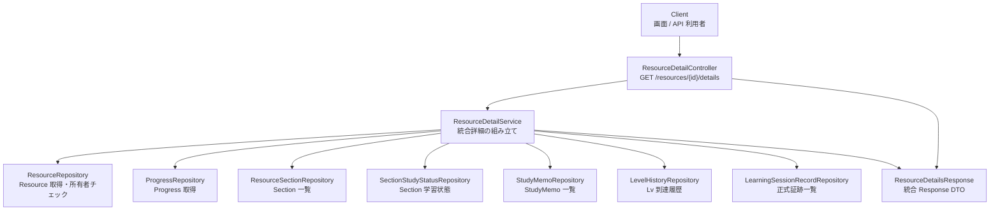

# 10-resource-detail-design.md

# SteerLog Resource Detail API Design

> **実装状況（2026-06-13）**: 本ドキュメントは Phase 8 の設計案である。`GET /resources/{resourceId}/details` は **未実装**。既存の `GET /resources/{resourceId}` は Resource + Progress のみ返す。

---

# 1. 目的

このドキュメントは、Phase 8 で実装予定の Resource Detail API（画面向け統合詳細）の設計を定義する。  
Flyway / Entity / Repository / Service / Controller / DTO / テスト実装時は、`docs/03-api-design.md`・`docs/06-implementation-rules.md` とあわせて本ドキュメントを基準にする。

Resource Detail API は、Resource 単体の情報だけでなく、その Resource に紐づく関連データを 1 リクエストでまとめて返し、学習対象の現在地を画面 / API 上で把握しやすくする。

* Resource の基本情報を取得する
* Progress を取得する
* Sections と SectionStudyStatus をまとめて取得する
* StudyMemo を取得する
* LevelHistory を取得する
* LearningSessionRecord を取得する
* 学習対象ごとの現在地を一画面で把握できるようにする

---

# 2. API概要

## 1.1 エンドポイント

```http
GET /resources/{resourceId}/details
```

| 項目 | 内容 |
|------|------|
| メソッド | GET |
| パス | `/resources/{resourceId}/details` |
| 認証 | 未実装。他 API と同様、Controller では `TEMP_USER_ID = 1L` 固定 |
| レスポンス | `200 OK` + 統合詳細 JSON |
| 性質 | 参照系のみ（DB 更新なし） |

## 1.2 既存 API との関係

| API | 役割 | 状態 |
|-----|------|------|
| `GET /resources/{resourceId}` | 簡易詳細（Resource + Progress） | 実装済み・維持 |
| `GET /resources/{resourceId}/details` | 画面向け統合詳細 | **未実装（本設計）** |

簡易詳細 API は軽量取得・既存クライアント互換のために残す。  
画面の Resource 詳細表示は `details` を主に使う想定とする。

---

# 3. 集約対象

## 2.1 Resource

学習対象本体。

* `resourceId`
* `resourceType`
* `title`
* `author`
* `sourceUrl`
* `description`

`deletedAt IS NULL` のもののみ対象。論理削除済み Resource は取得不可。

## 2.2 Progress

Resource ごとの学習進捗。Resource 作成時に自動作成される 1 件。

本 API で返す主なフィールド:

* `status`
* `currentLevel`
* `currentSectionId`
* `initialStudiedAt`
* `lastStudiedAt`

## 2.3 ResourceSection + SectionStudyStatus

Section 一覧と、Section ごとの学習状態をネストして返す。

* Section は `sectionOrder` 昇順
* 論理削除済み Section は除外（`deletedAt IS NULL`）
* Section 作成時に `SectionStudyStatus` も自動作成されるため、各 Section に `studyStatus` を 1 件紐づける
* `SectionStudyStatus` は Section 配下の `studyStatus` オブジェクトとして返す（別配列にしない）

## 2.4 StudyMemo

Resource に紐づく学習メモ。

* `createdAt` 降順
* 論理削除済みは除外（`deletedAt IS NULL`）
* `resourceSectionId` が null の Resource 全体メモも含む

## 2.5 LevelHistory

Lv 到達履歴（初到達イベント）。

* `createdAt` 昇順
* 0 件の場合は空配列

## 2.6 LearningSessionRecord

正式な学習証跡。

* `createdAt` 降順
* 0 件の場合は空配列
* `conceptTags` は API 上は文字列配列（DB では `TEXT` 格納、Service でパース）

---

# 4. 含めないもの

本 API では以下を含めない。

* raw 回答ログ
* complete API の `resultDraft`（DB 非保存・レスポンス専用）
* AI 会話ログ全文
* `LearningSession` の進行中セッション詳細一覧
* 削除済み Resource / Section / Memo
* Resource Detail API 内での更新処理
* 新しい Level 判定
* 新しい LearningSession 作成

---

# 5. レスポンス構造案

## 4.1 トップレベル DTO（案）

```text
ResourceDetailsResponse
  resource              … ResourceSummaryResponse
  progress              … ProgressSummaryResponse
  sections              … List<ResourceSectionWithStudyStatusResponse>
  memos                 … List<StudyMemoSummaryResponse>
  levelHistories        … List<LevelHistoryResponse>（既存 DTO 流用可）
  learningSessionRecords … List<LearningSessionRecordSummaryResponse>
```

Entity を Controller から直接返さない。上記は Response DTO として新規作成する。

## 4.2 JSON 例

```json
{
  "resource": {
    "resourceId": 1,
    "resourceType": "BOOK",
    "title": "Webを支える技術",
    "author": "山本陽平",
    "sourceUrl": null,
    "description": "REST/API設計の基礎を学ぶための本"
  },
  "progress": {
    "status": "IN_PROGRESS",
    "currentLevel": 3,
    "currentSectionId": 10,
    "initialStudiedAt": "2026-06-01T10:00:00Z",
    "lastStudiedAt": "2026-06-11T10:00:00Z"
  },
  "sections": [
    {
      "resourceSectionId": 10,
      "title": "第1章 Webとは何か",
      "sectionOrder": 1,
      "studyStatus": {
        "studiedAt": "2026-06-01T10:00:00Z"
      }
    }
  ],
  "memos": [
    {
      "studyMemoId": 100,
      "resourceSectionId": 10,
      "memoType": "QUESTION",
      "content": "PUTとPATCHの違いがまだ曖昧",
      "createdAt": "2026-06-01T10:00:00Z"
    }
  ],
  "levelHistories": [
    {
      "level": 1,
      "sourceType": "INITIAL_STUDY_COMPLETION",
      "sourceId": null,
      "reasonCode": "INITIAL_STUDY_COMPLETED",
      "createdAt": "2026-06-01T10:00:00Z"
    }
  ],
  "learningSessionRecords": [
    {
      "learningSessionRecordId": 200,
      "sessionType": "IMMEDIATE_REFLECTION",
      "summary": "REST APIの基本を説明できた",
      "conceptTags": ["REST", "HTTP"],
      "weakPointSummary": "PATCHの使い分けが曖昧",
      "nextAction": "Progress更新APIでPATCH設計を整理する",
      "aiAssessment": "NEEDS_REVIEW",
      "createdAt": "2026-06-11T10:00:00Z"
    }
  ]
}
```

## 4.3 フィールド補足

* `sections[].studyStatus` は `studiedAt` を中心に返す。未学習 Section は `studiedAt: null`
* `levelHistories[].sourceId` は Lv.1 到達時に `null` になりうる（`docs/02-db-design.md` §10.3 参照）
* `learningSessionRecords` には `learningSessionId` を含めてもよいが、画面向けサマリでは省略可

---

# 6. Mermaid図

`ResourceDetailService` が複数 Repository からデータを取得し、Response DTO に組み立てる。



---

# 7. 取得順序

`ResourceDetailService#getResourceDetails(userId, resourceId)` の処理順序案。

```text
1. Resource を userId + resourceId + deletedAt IS NULL で取得
   → 見つからなければ ResourceNotFoundException（RESOURCE_NOT_FOUND）
2. Progress を userId + resourceId で取得
   → 見つからなければ ProgressNotFoundException（PROGRESS_NOT_FOUND）
3. Sections を userId + resourceId + deletedAt IS NULL、sectionOrder 昇順で取得
4. SectionStudyStatus を userId + resourceId で一括取得し、resourceSectionId で Map 化
5. Sections ごとに studyStatus を紐づけてネスト DTO を組み立てる（N+1 回避）
6. StudyMemo を userId + resourceId + deletedAt IS NULL、createdAt 降順で取得
7. LevelHistory を userId + resourceId、createdAt 昇順で取得
8. LearningSessionRecord を userId + resourceId、createdAt 降順で取得
   ※ Repository に一覧取得メソッド追加が必要（現状未実装）
9. 各 DTO に詰めて ResourceDetailsResponse を返す
```

トランザクションは `@Transactional(readOnly = true)` とする。

---

# 8. エラー方針

| 条件 | 例外 | コード | HTTP |
|------|------|--------|------|
| Resource が存在しない | `ResourceNotFoundException` | `RESOURCE_NOT_FOUND` | 404 |
| 他人の Resource（userId 不一致） | `ResourceNotFoundException` | `RESOURCE_NOT_FOUND` | 404 |
| 論理削除済み Resource | `ResourceNotFoundException` | `RESOURCE_NOT_FOUND` | 404 |
| Progress が存在しない | `ProgressNotFoundException` | `PROGRESS_NOT_FOUND` | 404 |

その他:

* Sections / Memos / LevelHistories / LearningSessionRecords が 0 件の場合は **空配列** を返す（404 にしない）
* details API は参照系のため **DB 更新しない**

---

# 9. 設計判断

* 既存 `GET /resources/{resourceId}` は簡易詳細として残す
* `GET /resources/{resourceId}/details` は画面向け統合詳細として **新規追加** する
* Entity を Controller から直接返さない
* 統合用の Response DTO を新規作成する
* `@ManyToOne` はまだ使わず、Repository で明示的に取得して Service で組み立てる
* N+1 を避けるため、`SectionStudyStatus` は `userId + resourceId` でまとめて取得し Map で Section に紐づける
* details API は更新処理を行わない（Level 到達・Progress 更新・Session 作成は別 API の責務）
* `LearningSessionRecord` は正式証跡として返す
* `LearningSession` の raw 回答や `resultDraft` は返さない（DB にも保存しない）

---

## 付録: 実装時の想定ファイル（参考）

本ドキュメント作成時点では未作成。

```text
Controller   … ResourceDetailController（または ResourceController に追加）
Service      … ResourceDetailService
Response DTO … ResourceDetailsResponse ほかネスト DTO
Repository   … LearningSessionRecordRepository に一覧取得メソッド追加
Test         … ResourceDetailServiceTest, ResourceDetailControllerTest（@WebMvcTest）
```

---

# 10. Future Candidate

将来、必要に応じて検討する拡張候補。

* **active LearningSession の簡易表示** … `IN_PROGRESS` / `COMPLETED` の sessionType・status・currentStep など最小情報
* **memo のページング** … 件数増加時の `limit` / `offset`
* **memo の sectionId / memoType 絞り込み** … Query パラメータ
* **learningSessionRecords の件数制限** … 直近 N 件のみ返す
* **Resource Detail の画面用 summary** … 例: 学習済み Section 数 / 全 Section 数、最新 Lv 到達日
* **フロントエンド実装時のレスポンス調整** … 画面要件に応じたフィールド追加・削減

---

# 11. 関連ドキュメント

| ファイル | 内容 |
|---------|------|
| `docs/02-db-design.md` | テーブル関係・論理削除方針 |
| `docs/03-api-design.md` | API 全体設計・既存 Resource 詳細 |
| `docs/06-implementation-rules.md` | 実装ルール・DTO 方針 |
| `docs/07-implementation-order.md` | Phase 8 詳細統合表示 |

---

# 12. まとめ

Resource Detail API は、学習対象の「今どこにいるか」を 1 回の GET で把握するための画面向け統合 API である。

```http
GET /resources/{resourceId}/details
```

で Resource / Progress / Sections+StudyStatus / Memos / LevelHistories / LearningSessionRecords を返す。  
更新・Level 判定・Session 作成は含めず、参照専用とする。
